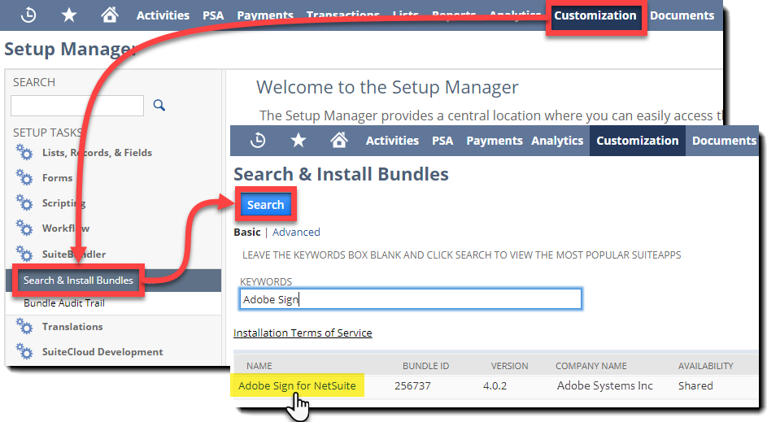
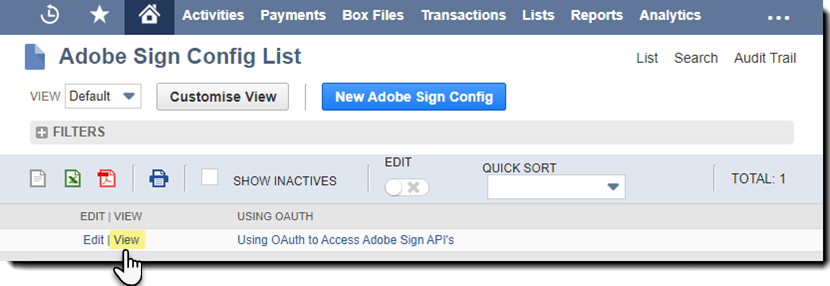
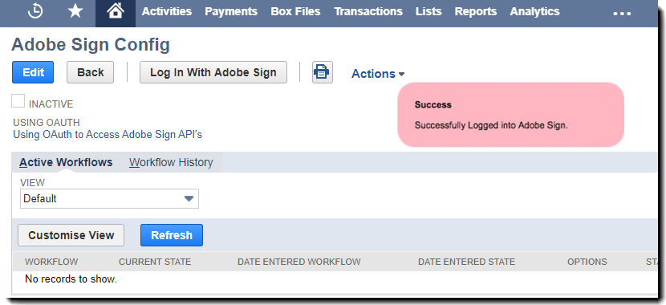
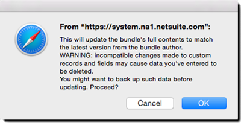

# [!DNL NetSuite] Installatie- en aanpassingsgids (v4.0.4) {#install-customize-NetSuite}

## Overzicht {#overview}

Adobe Sign for [!DNL NetSuite] biedt een volledige integratie van e-handtekeningen met [!DNL NetSuite]. U kunt Adobe Sign gebruiken voor [!DNL NetSuite] integratie om overeenkomsten zoals contracten, offertes en andere documenten, waarvoor elektronische handtekeningen vereist zijn, rechtstreeks naar ontvangers te verzenden vanuit [!DNL NetSuite]. U kunt Adobe Sign-overeenkomsten maken en verzenden van klanten, leads, offertes en andere [!DNL NetSuite] records. Adobe Sign-updates [!DNL NetSuite] met de status van overeenkomsten en slaat de overeenkomsten op met de bijbehorende [!DNL NetSuite] records zodra ze volledig zijn uitgevoerd. U kunt de geschiedenis bekijken van alle overeenkomsten die zijn verzonden vanuit [!DNL NetSuite] vanuit het product.

Raadpleeg de [Opmerkingen bij de release van Adobe Sign for NetSuite](https://experienceleague.adobe.com/docs/sign-integrations/using/netsuite/release-notes.html?lang=en) voor meer informatie.

## Installeer de bundel en configureer OAuth {#install}

Alleen een [!DNL NetSuite] de beheerder kan de bundel installeren of bijwerken. Om OAuth te configureren, [!DNL NetSuite] Beheerders moeten beheerdersrechten hebben voor Adobe Sign. Voordat u de bundel installeert in uw Productieaccount, moet u de bundel installeren en testen in een [!DNL NetSuite] Sandbox-account.

Zie [Een Adobe Sign-overeenkomst maken](#createagreement) voor meer informatie over testen.

>[!CAUTION]
>
>Klanten die een upgrade uitvoeren naar v4.0.4, mogen hun bestaande API-sleutel NIET verwijderen.
>
>Zie [Aangepaste voorkeuren instellen](#configure) voor meer informatie over het gebruik van de API-sleutel.

### Installeer de bundel voor de eerste keer

1. Navigeren naar [!UICONTROL **Customization > SuiteBundler > Search &amp; Install Bundles**].

1. Op de *Bundels zoeken en installeren* pagina, enter **Adobe Sign** als trefwoord en selecteer **[!UICONTROL Zoeken]**.

1. Selecteer de **Adobe Sign** bundelnaam.

   

1. Op de *[!UICONTROL Bundgegevens]* pagina, selecteert u **[!UICONTROL Installeren]**.
1. In het dialoogvenster *[!UICONTROL Voorvertoning bundelinstallatie]* pagina, selecteert u **[!UICONTROL Bundel installeren]**.

   (De standaardwaarden op de pagina hoeven niet te worden gewijzigd)

   

1. Selecteer in het dialoogvenster Installeren dat verschijnt de optie **[!UICONTROL OK]** om verder te gaan.

   Tijdens het installatieproces wordt de status van de bundel weergegeven als *[!UICONTROL In behandeling]*.

   

1. Als u een bijgewerkte status wilt weergeven, selecteert u **[!UICONTROL Vernieuwen]**.

   Nadat de bundelinstallatie is voltooid, *Adobe Sign for[!DNL NetSuite]* wordt weergegeven op het tabblad *[!UICONTROL Geïnstalleerde bundels]* pagina.

   

1. Als u al een Adobe Sign-klantaccount hebt, voert u de volgende stappen uit:  [OAuth configureren na installatie of upgrade](#oauth).

   Als u geen Adobe Sign-account hebt, kunt u [inschrijven voor een proefversie voor ondernemingen](https://esign.adobe.com/adobe-sign-netsuite-trial-registration.html) account om het systeem te testen. Volg de online registratiestappen om uw Adobe Sign-account in te schakelen.

## OAuth configureren na installatie of upgrade {#oauth}

Adobe Sign gebruikt OAuth 2.0 om uw Adobe Sign-account te verifiëren binnen [!DNL NetSuite].

Met dit protocol wordt uw geïnstalleerde [!DNL NetSuite] om te communiceren met Adobe Sign zonder om uw wachtwoord te vragen. Aangezien gevoelige informatie niet rechtstreeks tussen de apps gedeeld wordt, is het minder waarschijnlijk dat derden toegang tot uw account krijgen.

Deze verificatie heeft geen invloed op uw implementatie, maar u moet een eenmalige configuratie uitvoeren nadat u de bundel hebt geïnstalleerd of bijgewerkt in uw productie- of Sandbox-account.

De [!DNL NetSuite] beheerder die OAuth configureert, moet ook beheerderstoegang op accountniveau tot Adobe Sign hebben.

1. In [!DNL NetSuite], navigeert u naar de *Adobe Sign Config* lijstpagina.

1. Zoeken naar **[!UICONTROL Adobe Sign Config]** (een aangepast recordtype) met behulp van het veld Zoeken in de koptekst.

1. Selecteer op de pagina Zoekresultaten de optie **Weergave** voor de *Adobe Sign Config* opnemen.

   

1. Selecteer op de pagina Adobe Sign Config de optie **[!UICONTROL Weergave]** voor de *OAuth gebruiken om toegang te krijgen tot Adobe Sign API&#39;s* opnemen.

   

1. Selecteer op de pagina Adobe Sign Config de optie **[!UICONTROL Aanmelden met Adobe Sign]**

   

1. Voer op de Adobe Sign-aanmeldingspagina die verschijnt uw referenties in en selecteer **[!UICONTROL Aanmelden]**.

   

1. Selecteer op de pagina Toegang bevestigen (voor OAuth) die wordt weergegeven de optie **[!UICONTROL Toegang toestaan]**

   

1. Wanneer de autorisatie is voltooid, wordt u teruggeleid naar de Adobe Sign Config-pagina in [!DNL NetSuite], zoals hieronder weergegeven.

   

   >[!NOTE]
   >
   >Bij het configureren van OAuth in uw Sandbox-account kan de fout &#39;&#39;Kon de samenstelling van de klant niet bepalen&#39;&#39; optreden wanneer de verificatie is voltooid.
   >
   >
   >Als u wilt doorgaan, moet u het accountdomeingedeelte van de URL (system.netsuite.com) in uw browser wijzigen om terug te verwijzen naar de [!DNL NetSuite] Sandbox als hieronder:
   >
   >
   >Wijzigen:
   >
   >
   >system.netsuite.com/app/site/hosting/scriptlet.nl?script=745&amp;deploy=1&amp;web_access_point=https://echosign.com
   >
   >
   >Aan:
   >
   >
   >systeem.**sandbox.** netsuite.com/app/site/hosting/scriptlet.nl?script=745&amp;deploy=1&amp;web_access_point=https://echosign.com

## De bundel (bestaande gebruikers) bijwerken

[!DNL NetSuite] bundle-updates worden regelmatig vrijgegeven door Adobe. Bestaande gebruikers van de Adobe Sign for [!DNL NetSuite] integratie kan worden bijgewerkt naar de nieuwste bundel.

>[!CAUTION]
>
>Klanten die een upgrade uitvoeren naar een nieuwere versie, mogen hun bestaande API-sleutel NIET verwijderen.
>
>Zie [Aangepaste voorkeuren instellen](#configure) voor meer informatie over het gebruik van de API-sleutel.

### Vereisten {#prerequisites}

De tijd die nodig is om de versie 4.0.4-bundel bij te werken, is afhankelijk van het aantal overeenkomsten met de status Verzonden ter ondertekening. Meestal duurt het 7 tot 10 minuten om 100 overeenkomsten bij te werken. Houd rekening met het aantal records waarmee u de updatetijd inschat.

Bepaal het aantal overeenkomsten dat ter ondertekening is verzonden:

1. Navigeren naar **[!UICONTROL Aanpassing > Lijsten, records en bestanden > Recordtypen]**, dan zoeken *Adobe Sign-overeenkomst.*

   Of zoek in de zoekbalk naar Adobe Sign-overeenkomsten.

1. Voor de [!UICONTROL Adobe Sign-overeenkomsten] record, selecteren **[!UICONTROL Zoeken]**.

   

1. Van de **[!UICONTROL Status]** vervolgkeuzelijst, selecteert u **[!UICONTROL Verzonden voor ondertekening]** en selecteer vervolgens **[!UICONTROL Verzenden]**.

   

   Houd rekening met het aantal records waarmee u de updatetijd inschat.

   

### De bundel bijwerken {#updating-the-bundle}

1. Navigeren naar **[!UICONTROL Aanpassing > SuiteBundler > Zoeken en installeren > Lijst]** en zoek de huidige bundel, zoals hieronder weergegeven.

   >[!NOTE]
   >
   >Als er een nieuwe versie van de bundel is, wordt rechts van het *Versie* aantal van uw huidige bundel.

1. Selecteer in het vervolgkeuzemenu Actie de optie **[!UICONTROL Bijwerken]**.

   

1. Selecteer op de pagina Voorvertoning bundelupdate de optie **[!UICONTROL Bundel bijwerken]** zonder de standaardwaarden te wijzigen die op de pagina worden weergegeven.

   Tijdens de installatie wordt de status van de bundel weergegeven als *In behandeling*.

   .

   >[!NOTE]
   >
   >Wanneer u de bundel bijwerkt, krijgt u mogelijk een waarschuwingsbericht zoals hieronder weergegeven. Als u uw [!DNL NetSuite] e-handtekeningrecords kunt u doorgaan. Als u niet zeker weet, kunt u de bundel het best op een Sandbox-account installeren om deze eerst te testen voordat u de bundel in een productieaccount bijwerkt.

   

1. Als u een bijgewerkte status wilt weergeven, selecteert u **[!UICONTROL Vernieuwen]**.

   

   >[!NOTE]
   >
   >Als de update lang duurt vanwege verschillende overeenkomsten met een *Verzonden voor ondertekening* kunt u de **[!UICONTROL Uitvoeringslogboek]** subtab voor de *Installatie van Adobe Sign-bundel* om de voortgang van uw update te bepalen. Zie [De voortgang van de update bepalen](#determineprogress) voor meer informatie.

   Nadat de bundelupdate is voltooid, *Adobe Sign for[!DNL NetSuite]* wordt weergegeven op het tabblad *Geïnstalleerde bundels* pagina.

   

## De bundel configureren {#configure}

### Aangepaste voorkeuren instellen  {#set-custom-preferences}

U kunt aangepaste voorkeuren gebruiken om op te geven hoe overeenkomsten worden gemaakt en opgeslagen in [!DNL NetSuite]. Bovendien wordt *Gebruiker automatisch toewijzen in Adobe Sign* kunt u opgeven of [!DNL NetSuite] gebruikers worden automatisch toegewezen in Sign-services wanneer ze overeenkomsten verzenden van [!DNL NetSuite].

1. Navigeren naar **[!UICONTROL Setup > Bedrijf > Algemene voorkeuren]**.
1. Schuif omlaag op de pagina en selecteer vervolgens de **[!UICONTROL Aangepaste voorkeuren]** subtab.

   

1. Schakel uw Adobe Sign-voorkeuren naar wens in en configureer ze:

   * **EchoSign API-sleutel voor uw account invoeren**: Voeg in dit veld geen waarde toe of bewerk deze.
   * **Contactpersoon bovenliggende record gebruiken als ondertekenaar**: Indien ingeschakeld, wordt de contactpersoon voor de bovenliggende record standaard ingesteld als de eerste ondertekenaar bij het maken van overeenkomsten. De afzender kan de standaardondertekenaar gemakkelijk verwijderen of bewerken of extra ondertekenaars aan de overeenkomst toevoegen voordat hij de overeenkomst verzendt.
   * **Gebruik Trans. Contact opnemen als ondertekenaar indien aanwezig**: Deze voorkeur is alleen geldig als de *Contactpersoon bovenliggende record gebruiken als ondertekenaar* voorkeur is ook ingeschakeld. Als deze optie is ingeschakeld, wordt bij het genereren van een overeenkomst op basis van een transactierecord (bijvoorbeeld Offerte) de primaire contactpersoon voor transacties standaard ingesteld als de eerste ondertekenaar. Zie [Transactieverslagen](#transrecords) voor meer informatie. Als er geen primaire transactielink is, of als er wordt verzonden van [!DNL NetSuite] objectrecord (bijvoorbeeld Klantrecord, partnerrecord), is de standaardontvanger de primaire contactpersoon voor de e-mail van de klant. De afzender kan de standaardondertekenaar gemakkelijk verwijderen of bewerken of extra ondertekenaars aan de overeenkomst toevoegen voordat hij de overeenkomst verzendt.
   * **Ontvangers markeren als fiatteurs toestaan**: Indien ingeschakeld kunnen afzenders ontvangers markeren als fiatteurs. Als fiatteurs gemarkeerde ontvangers kunnen overeenkomsten reviseren en goedkeuren, maar ze zijn niet verplicht ze te ondertekenen. Fiatteurs kunnen worden verplicht gegevens in velden in te voeren tijdens het goedkeuringsproces.
   * **Voorkeursmap-id voor overeenkomst**: Wordt gebruikt om de map op te geven waarin de uiteindelijke ondertekende overeenkomsten worden opgeslagen. Als u voor dit veld geen waarde instelt, worden de uiteindelijke ondertekende overeenkomsten standaard opgeslagen in dezelfde map als het oorspronkelijke documentbestand. De map-id moet een getal zijn.
   * **Transactie-PDF automatisch koppelen**: Indien ingeschakeld worden PDF van transacties automatisch gekoppeld aan overeenkomsten wanneer nieuwe overeenkomsten worden gemaakt op basis van transactierecords.
   * **Ondertekende PDF toevoegen als (bijlage of koppeling)**: Als *Lijst* is geselecteerd in de vervolgkeuzelijst, wordt de Ondertekende PDF automatisch toegevoegd als een koppeling naar het bestand. Als *Bijlage* is geselecteerd in de vervolgkeuzelijst, wordt de ondertekende PDF opgeslagen in [!DNL NetSuite] als bijlage in de overeenkomstrecord.
   * **PDF van audittrail opnemen bij overeenkomst**: Als deze optie is ingeschakeld, worden PDF van audittrails automatisch toegevoegd aan overeenkomstrecords nadat de overeenkomsten zijn ondertekend.
   * **Identiteitsverificatiemethode is van toepassing op**: Als u een van de methoden voor identiteitsverificatie inschakelt, bepaalt u aan wie de identificatiemethode wordt toegepast. De volgende opties zijn beschikbaar: *Alle ondertekenaars, alleen externe ondertekenaars*, of *Alleen interne ondertekenaars*.

   **Methoden voor identiteitsverificatie** {#identity-verification-methods}

   Ingeschakelde identiteitsverificatiemethode(n) kunnen worden geselecteerd bij het maken van een overeenkomst. Als hier meer dan één methode voor identiteitsverificatie is ingeschakeld, wordt op de pagina Adobe Sign Agreement een **[!UICONTROL Identiteit ondertekenaar verifiëren]** gebruiken.

   * **Wachtwoord vereist voor ondertekening inschakelen**: Vereisen dat ondertekenaars een eenmalig wachtwoord invoeren dat u opgeeft.

   * **Verificatie op basis van kennis inschakelen**: Verplicht ondertekenaars om hun naam, adres en optioneel de laatste vier cijfers van hun burgerservicenummer op te geven en vervolgens een lijst met vragen te beantwoorden ter verificatie van de informatie die ze hebben verstrekt. Alleen beschikbaar in de Verenigde Staten.

   * **Webidentiteitsverificatie inschakelen**: Vereisen dat ondertekenaars hun identiteit verifiëren door zich aan te melden bij een van de volgende sites: Facebook, Google, LinkedIn, Microsoft Live, Twitter of Yahoo!

   * **Gebruiker automatisch toewijzen in Adobe Sign**: Indien ingeschakeld, gebruikers die overeenkomsten verzenden in [!DNL NetSuite] automatisch worden ingericht voor een Adobe Sign-gebruikersaccount.

1. Selecteren **[!UICONTROL Opslaan]** om uw voorkeuren op te slaan.

## Automatische statusupdates configureren {#asu}

Met de Adobe Sign-integratiebundel kunt u automatisch updates ontvangen in [!DNL NetSuite] betreffende de status van de overeenkomsten die zijn verzonden van [!DNL NetSuite]. Wanneer deze functie is ingeschakeld, [!DNL NetSuite] geeft altijd de status van uw overeenkomsten weer. U kunt automatische statusupdates als volgt inschakelen:

1. Navigeren naar **[!UICONTROL Setup > Bedrijf > Functies inschakelen].**
1. Selecteer de **[!UICONTROL SuiteCloud]** subtab.
1. Schakel de volgende opties in:

   * Schakel in de sectie SuiteBuilder de optie **[!UICONTROL Aangepaste records]** gebruiken.

   * Schakel in de sectie SuiteScript de optie **[!UICONTROL Client SuiteScript]** en **[!UICONTROL Server SuiteScript]** en ga akkoord met de servicevoorwaarden voor beide.

1. Selecteren **[!UICONTROL Opslaan]**.

   Uw opties worden ingesteld zoals weergegeven in de afbeelding.

   

## Objecten en recordtypen {#objects}

De Adobe Sign-integratiebundel maakt het Adobe Sign Agreement-object al toegankelijk met een groot aantal standaarden [!DNL NetSuite] objecten, waaronder: Klant, Schatting, Lead, Opportunity en Partner-records. U kunt de Adobe Sign-bundel ook gebruiken met andere recordtypen, waaronder aangepaste records.

Het tabblad Overeenkomst kan worden weergegeven met twee typen [!DNL NetSuite] records: Entiteits- en transactieregisters. We gaan er doorgaans van uit dat een transactierecord een record is (zoals een aanhalingsteken) dat kan worden geconverteerd naar een PDF-document; terwijl een entiteitsrecord niet kan worden omgezet in een PDF.

## Transactierecords {#transrecords}

Als de overeenkomst is gemaakt op basis van een transactierecord, is het eerste document in de overeenkomstrecord de PDF-versie van de record waaruit de overeenkomst is voortgekomen en is de eerste ontvanger het e-mailadres van de record. Als u niet wilt dat het eerste document een PDF-versie is van de record waaruit het afkomstig is, gaat u naar **[!UICONTROL Setup > Bedrijf > Algemene voorkeuren > Subtabblad Aangepaste voorkeuren]** en schakelt u de **[!UICONTROL Transactie-PDF automatisch koppelen]** gebruiken. Zie [Aangepaste voorkeuren instellen](#configure) voor meer informatie.

Onder Aangepaste voorkeuren kunt u ook de opdracht **[!UICONTROL Gebruik Trans. Contact opnemen als eerste ondertekenaar]** als u wilt dat de primaire transactielink automatisch wordt toegevoegd als de eerste ondertekenaar. Als dit aan een transactierecord is gekoppeld, wordt het **[!UICONTROL Overeenkomsten]** en de **[!UICONTROL Send for Signature]** knoppen.

## Entiteitsrecords {#entity-records}

Als de overeenkomst is gemaakt op basis van een entiteitsrecord, is de eerste ontvanger het e-mailadres uit de record. Wanneer deze aan een entiteitrecord is gekoppeld, wordt alleen het tabblad Overeenkomsten weergegeven.

## De bundel aanpassen {#customize}

Het aanpassen van de bundel omvat het volgende:

* De scripts voor het subtabblad Overeenkomsten en de knop Send for Signature voor de juiste recordtypen implementeren.
* Rolmachtigingen instellen voor uw Adobe Sign-recordtypen.
* Machtigingen wijzigen om toegang te verlenen tot de *Overeenkomsten* subtab en de *Send for Signature* knop.

### Adobe Sign-overeenkomsten configureren voor extra recordtypen  {#configuring-adobe-sign-agreements-for-additional-record-types}

Om het *Overeenkomsten* subtab en de *Send for Signature* knop voor de juiste recordtypen:

1. Navigeren naar **[!UICONTROL Aanpassing > Scripts > Scripts].**

1. Op de *Scripts* de lijstpagina die verschijnt, bepaal de plaats van het manuscript u moet opstellen, dan uitgezocht ****[!UICONTROL Weergave]****.

   * Als u de opdracht *Send for Signature* selecteert u **[!UICONTROL Adobe Sign Estimate Button]** script.

   * Als u de opdracht *Overeenkomsten* tab, selecteer **[!UICONTROL Loader Adobe Sign-overeenkomst]** script.

1. Selecteer op de scriptpagina **[!UICONTROL Script implementeren]**.

   

1. Ga als volgt te werk op de pagina Scriptimplementatie:

   * Van de *Van toepassing op* selecteert u het type record.
   * Voer desgewenst de implementatie-id voor het script in.

      Raadpleeg de *Een aangepaste script-implementatie-id maken* in het [!DNL NetSuite] Help Center voor meer informatie. Als u geen id opgeeft, wordt er een gegenereerd.

   * Controleer de **[!UICONTROL Gedistribueerd]** selectievakje.

   

   * Instellen *Status* aan **[!UICONTROL Uitgegeven]**.

      U hoeft geen *Type gebeurtenis* of *Logboekniveau*.

   * Van de [!UICONTROL *Uitvoeren als rol]*, selecteer **[!UICONTROL Uitvoeren als beheerder]**.

   * Met de **[!UICONTROL Doelgroep]** subtab actief (standaard actief), selecteert u de specifieke rollen of gebruikers aan wie u toegang wilt verlenen. Als u toegang wilt verlenen tot alle rollen en gebruikers, schakelt u de respectievelijke **[!UICONTROL Alles selecteren]** opties.

   * Selecteren **[!UICONTROL Opslaan]**. Selecteer **[!UICONTROL Terug]**.

1. selecteren **[!UICONTROL Lijst]** boven aan de pagina Scriptimplementatie om terug te gaan naar de *Scripts* lijstpagina.
1. Herhaal de stappen 2 en 3 hierboven voor het andere script.

## Rolmachtigingen instellen voor Adobe Sign-recordtypen {#setting-role-permissions-for-adobe-sign-record-types}

Meeste [!DNL NetSuite] rollen moeten toestemming hebben om Adobe Sign te gebruiken zonder aanvullende aanpassing. U moet echter wel machtigingen verlenen voor extra aangepaste rollen die zijn gemaakt.

1. Navigeren naar **[!UICONTROL Aanpassing > Lijsten, records en bestanden > Recordtypen]**.

   

   >[!NOTE]
   >
   >Als u de *Recordtypen* item, navigeren naar **[!UICONTROL Setup > Bedrijf > Functies inschakelen > tabblad Suite Cloud]** en de *Aangepaste records* gebruiken.

1. Op de *Recordtypen* pagina, selecteert u **[!UICONTROL Adobe Sign-overeenkomst]** om het te selecteren

   

1. Op de *Type aangepaste record* pagina, selecteert u **[!UICONTROL Machtigingenlijst gebruiken]** van de *Toegangstype* vervolgkeuzelijst.

   

   >[!NOTE]
   >
   >De *Adobe Sign-overeenkomst* recordtype is het enige Adobe Sign-recordtype dat het vereiste *Gebruikt machtigingenlijst* toegangstype.
   >
   >
   >Zie stap 6 voor instructies voor het instellen van het toegangstype voor de andere Adobe Sign-recordtypen.

1. Selecteer de **[!UICONTROL Machtigingen]** subtab.

   De lijst met rollen en machtigingen wordt weergegeven.

   

1. Stel de machtigingen als volgt in voor de extra aangepaste rollen die zijn toegevoegd aan &quot;[!UICONTROL Adobe Sign-overeenkomst]&quot; recordtype.

   >[!NOTE]
   >
   >Zie de *[Een machtigingenlijst instellen voor een aangepast recordtype](https://system.netsuite.com/app/help/helpcenter.nl?fid=section_N2879931.html)* in het Help Center voor meer informatie

   1. Selecteer de rol in het menu *Rol* lijst.
   1. Instellen *Niveau* aan **[!UICONTROL Volledig]**.
   1. Instellen *Standaardformulier* aan **[!UICONTROL Aangepast EchoSign-overeenkomstformulier]**.
   1. Selecteren **[!UICONTROL Formulier beperken]** selectievakje.
   1. Selecteren **[!UICONTROL Toevoegen]** om de wijzigingen voor de rolrij op te slaan.

   

   De nieuwe rij wordt weergegeven zoals hieronder weergegeven:

   

   Herhaal de stappen a tot en met e hierboven voor alle extra aangepaste rollen.

   * selecteren **[!UICONTROL Opslaan]** op de *Type aangepaste record* pagina wanneer machtigingen voor alle rollen zijn ingesteld.
   De *[!UICONTROL Type klantrecord]* pagina wordt opnieuw weergegeven.

1. Herhaal de stappen 1 tot en met 3 hierboven om de *Toegangstype* voor alle andere Adobe Sign-recordtypen naar

   **[!UICONTROL Geen toestemming vereist].** Dit is van toepassing op de volgende recordtypen:

   * Adobe Sign Config
   * Adobe Sign-document
   * Adobe Sign-gebeurtenis
   * Adobe Sign Language
   * Adobe Sign-scriptfouten
   * Door Adobe Sign ondertekende overeenkomst
   * Adobe Sign Signer

### Toegang verlenen tot het tabblad Overeenkomsten en de knop Send for Signature  {#granting-access-to-the-agreement-tab-and-send-for-signature-button}

De Adobe Sign-integratiebundel maakt het Adobe Sign Agreement-object al toegankelijk met een groot aantal standaarden [!DNL NetSuite] objecten (klant, schatting) [Offerte], lead en meer). De *Overeenkomst* Subtab wordt automatisch ingeschakeld voor de volgende typen objecten: Klant, Lead, Opportunity, Partner, Prospect, Offerte en Bill van leverancier.

De *[!UICONTROL Send for Signature]* knop wordt automatisch ingeschakeld **o[!UICONTROL Alleen voor het object Offerte]**.

[!DNL NetSuite] beheerders kunnen de mogelijkheid om overeenkomsten te maken uitbreiden naar extra CRM-objecten door machtigingen te wijzigen om de *Overeenkomst* subtab *Send for Signature* of beide om deze objecten te selecteren.

#### Machtigingen wijzigen om toegang te verlenen tot de knop Send for Signature  {#modifying-permissions-to-grant-access-to-the-send-for-signature-button}

1. Navigeren naar **[!UICONTROL Aanpassing > Scripts > Scripts]**.

   De *Scripts* weergegeven.

   * Gebruik indien nodig de filters om de Adobe Sign-scripts te zoeken

1. Op de *Scripts* pagina, zoekt u de *Adobe Sign Estimate Button* script (beheert de *Send for Signature* , selecteert u **Weergave**.

   

1. Op de *Script* en doet u het volgende:

   * selecteer de **[!UICONTROL Implementaties]** subtab

   * Onder &quot;*Van toepassing op*&quot; Selecteer de koppeling voor de entiteit die u wilt wijzigen.

      * **[!UICONTROL Offerte]** in dit voorbeeld

   

   * selecteer de **[!UICONTROL Bewerken]** op de knop *Scriptimplementatie* pagina

   

   * Met de **[!UICONTROL Doelgroep]** actieve subtabblad, selecteert u de specifieke rollen of gebruikers aan wie u toegang wilt verlenen.

      * Als u toegang wilt verlenen tot alle rollen en gebruikers, schakelt u de respectievelijke **[!UICONTROL Alles selecteren]** opties
   * selecteren **[!UICONTROL Opslaan]**

   

#### Machtigingen wijzigen om toegang te verlenen tot het tabblad Overeenkomsten  {#modifying-permissions-to-grant-access-to-the-agreements-tab}

1. Navigeren naar **[!UICONTROL Aanpassing > Scripts > Scripts]**
1. Op de [!UICONTROL Scripts] pagina, zoekt u de *[!UICONTROL Loader Adobe Sign-overeenkomst]* script (beheert de *Het tabblad Overeenkomsten*) en selecteer vervolgens **[!UICONTROL Weergave]**.
1. Op de *Script* en doet u het volgende:

   1. Selecteer de **[!UICONTROL Implementaties]** subtab
   1. Onder &quot;*[!UICONTROL Van toepassing op]*&quot; selecteer de koppeling voor de entiteit waarvoor u de toegang wilt wijzigen
   1. Op de *[!UICONTROL Scriptimplementatie]* pagina selecteert u de **[!UICONTROL Bewerken]** knop
   1. Met de **[!UICONTROL Doelgroep]** actieve subtab (deze is standaard actief), selecteert u de specifieke rollen of gebruikers aan wie u toegang wilt verlenen. Als u toegang wilt verlenen tot alle rollen en gebruikers, schakelt u de respectievelijke **[!UICONTROL Alles selecteren]** opties
   1. selecteren **[!UICONTROL Opslaan]**

## Adobe Sign gebruiken voor [!DNL NetSuite] bundelen

Om overeenkomsten te verzenden van [!DNL NetSuite] en updates over deze overeenkomsten ontvangen, moeten gebruikers dezelfde aanmeldings-id (e-mailadres) hebben in [!DNL NetSuite] en in Adobe Sign.

### Een Adobe Sign-overeenkomst maken

Nadat u een nieuwe bundel in een Sandbox- of Productieaccount hebt geïnstalleerd, moet u de bundel testen door een nieuwe overeenkomst te maken. U kunt Adobe Sign-overeenkomsten maken op basis van een entiteitrecord, op basis van een transactierecord of als een zelfstandige overeenkomst.

>[!NOTE]
>
>Het proces voor het maken van een overeenkomst verschilt enigszins afhankelijk van de manier waarop de overeenkomst is gemaakt. Het algemene proces bestaat uit het opgeven van de opties voor uw overeenkomst, het toevoegen van een of meer overeenkomstdocumenten en het opgeven van de ontvangers. Bij het hieronder beschreven proces wordt ervan uitgegaan dat u de overeenkomst maakt op basis van een klantrecord.

1. Selecteer of maak een klantrecord waaruit u een overeenkomst wilt verzenden, of selecteer een andere [!DNL NetSuite] recordtype waarvoor het tabblad Overeenkomsten is ingeschakeld.

1. Selecteer in de record de optie **[!UICONTROL Overeenkomsten]** subtab.
1. Selecteren **[!UICONTROL Nieuwe overeenkomst]**.

   

1. Op de *[!UICONTROL Adobe Sign-overeenkomst]* pagina, selecteert u **[!UICONTROL Bewerken]**.

   

1. Geef de opties voor uw overeenkomst als volgt op:

   * **Naam overeenkomst** — Voer een naam in voor de overeenkomst.
   * **Bericht**- Voer een aangepast bericht in voor de ontvanger.
   * **Handtekeningtype** — Selecteer het type handtekening dat is geaccepteerd voor het document. De volgende opties zijn beschikbaar: *e-handtekening* en *Handtekening faxen*.

   * **Ik moet deze overeenkomst ook ondertekenen** — Schakel deze optie in om aan te geven dat de afzender de overeenkomst ook moet ondertekenen.
   * **Handtekeningenvolgorde**-Als de *Ik moet deze overeenkomst ook ondertekenen* is ingeschakeld, selecteert u de volgorde waarin de afzender en de ontvangers moeten ondertekenen. De opties zijn &quot;Ik onderteken, vervolgens ondertekenen ontvangers&quot;, &quot;Ontvangers ondertekenen, dan onderteken ik&quot; en &quot;Geen&quot;.

   * **Voorvertoning van document- of positiehandtekeningen (of formuliervelden)** — Schakel deze optie in om verzenders in staat te stellen een voorvertoning van de overeenkomst weer te geven en om hen in staat te stellen velden (slepen en neerzetten, initiële velden en andere formuliervelden) aan de overeenkomst toe te voegen voordat deze naar ontvangers wordt verzonden.
   * **Identiteit ondertekenaar verifiëren** — Schakel deze optie in en selecteer een van de volgende opties voor identiteitsverificatie

      * Deze optie wordt alleen weergegeven wanneer in de aangepaste voorkeuren meer dan een van de drie hieronder vermelde methoden voor identiteitsverificatie van ondertekenaars is ingeschakeld. (Zie [Aangepaste voorkeuren instellen](#customize) voor meer informatie.) Als slechts één voorkeur is ingeschakeld, wordt de opdracht **[!UICONTROL Identiteit ondertekenaar verifiëren]** wordt niet weergegeven.

   **Methoden voor identiteitsverificatie**

   * **Wachtwoord vereist om te ondertekenen** — Vereisen dat ondertekenaars een eenmalig wachtwoord invoeren dat u opgeeft.
   * **Verificatie op basis van kennis** — Verplicht ondertekenaars om hun naam, adres en optioneel de laatste vier cijfers van hun burgerservicenummer op te geven en vervolgens een lijst met vragen te beantwoorden ter verificatie van de informatie die ze hebben verstrekt. Alleen beschikbaar in de Verenigde Staten.
   * **Webidentiteitsverificatie** — Vereisen dat ondertekenaars hun identiteit verifiëren door zich aan te melden bij een van de volgende sites: Facebook, Google, LinkedIn, Twitter, Yahoo! of Microsoft Live.
   * **Wachtwoord vereist voor weergave van PDF** — Schakel deze optie in om te vereisen dat een ontvanger een wachtwoord invoert voordat een PDF van de overeenkomst of de ondertekende overeenkomst wordt geopend. Het PDF-bestand dat naar iedereen wordt verzonden, wordt gecodeerd en moet met het wachtwoord worden geopend. Raak uw wachtwoord niet kwijt omdat het niet kan worden teruggezet. Als u het wachtwoord verliest, moet u die transactie verwijderen en opnieuw beginnen.
   * **Wachtwoord/wachtwoord bevestigen** — Als de *Wachtwoord vereist voor weergave van PDF* is ingeschakeld, voert u het wachtwoord in dat moet worden gebruikt om de overeenkomst weer te geven.
   * **Ontvangers eraan herinneren te tekenen** — Geef op of en hoe vaak herinneringen naar ontvangers worden verzonden. De volgende opties zijn beschikbaar: *Nooit*, *Dagelijks* of *Wekelijks*.
   * **Taal:** Geef de taal op waarin de ondertekeningspagina en de e-mailmeldingen aan de ontvangers worden weergegeven.
   * **Host tekent voor de eerste ondertekenaar** — Schakel deze optie in om de gastheer van de afzender persoonlijke ondertekening voor de eerste ondertekenaar toe te staan.
   * **Dagen tot ondertekeningsdeadline** — Voer een geheel getal in om de ondertekeningsdeadline voor de overeenkomst aan te geven (de datum van vandaag + het aantal dagen).
   * **Bovenliggende record** — Selecteer desgewenst een bovenliggende record om deze te koppelen aan de overeenkomst.

   

1. Selecteer de **[!UICONTROL Documenten]** tabblad.

   

1. Op de *Documenten* subtabblad, een bestaand document vanuit de bestandsruimte bijvoegen met behulp van de *Adobe Sign-document* en selecteert u vervolgens **[!UICONTROL Bijvoegen]**.

   Of klik op **[!UICONTROL Nieuw Adobe Sign-document]** om toegang te krijgen tot *[!UICONTROL Adobe Sign-document]* en typ vervolgens de naam van een document in uw [!DNL NetSuite] bestandscabinet, selecteer bestanden uit uw transactierecord (indien van toepassing) of voeg een nieuw document toe.

   U kunt meerdere documenten aan een overeenkomst toevoegen.

1. Selecteren **[!UICONTROL Ontvangers]** en geef de ontvanger op door een keuze te maken in de lijst met contactpersonen of door een e-mailadres te typen.

   

   Elk van uw ontvangers kan worden gemarkeerd als Ondertekenaar of CC. Als de *Ontvangers markeren als ondertekenaars van fiatteurs toestaan* aangepaste voorkeur is ingeschakeld, ontvangers kunnen ook worden gemarkeerd als fiatteurs. Zie [Aangepaste voorkeuren instellen](#customize) voor meer informatie.

   * **Ondertekenaars** moet de overeenkomst ondertekenen.
   * **Fiatteurs** moet de overeenkomst goedkeuren, maar niet ondertekenen, en kan optioneel gegevens aan een overeenkomst toevoegen.
   * **CC-ontvangers** op de hoogte worden gesteld van updates van overeenkomsten en wanneer de overeenkomst wordt ondertekend en voltooid. CC-ontvangers zijn geen partij bij het ondertekenings- of goedkeuringsproces.

      Als de *Contactpersoon bovenliggende record gebruiken als ondertekenaar* aangepaste voorkeur is alleen of in combinatie met de *Gebruik Trans. Contact opnemen als ondertekenaar* is ingesteld, wordt de eerste ontvanger standaard ingesteld, maar kan worden gewijzigd.

1. Selecteren **[!UICONTROL Toevoegen]** na het invoeren van elke ontvanger.

1. Selecteren **[!UICONTROL Opslaan]** om de overeenkomst op te slaan.

### Overeenkomsten verzenden ter ondertekening

Wanneer de overeenkomst klaar is om te worden verzonden, selecteert u de **[!UICONTROL Send for Signature]** knop.

* Als de *Voorvertoning van document of positie van handtekeningen* optie is ingeschakeld, klik op **[!UICONTROL Send for Signature]**. Geef in het venster dat wordt geopend een voorvertoning van het document weer of sleep formuliervelden naar het document voordat het wordt verzonden. Selecteren **[!UICONTROL Verzenden]** om de overeenkomst naar de ontvanger te verzenden.

* Als de *[!UICONTROL Host tekent voor eerste ondertekenaar]* optie is ingeschakeld, klik op **[!UICONTROL Send for Signature]**. In het venster dat wordt geopend, kan de ondertekenaar het document ondertekenen met de afzender.

   A *Host tekent voor huidige ondertekenaar* de koppeling verschijnt ook naast de *Host tekent voor eerste ondertekenaar* veld, dat kan worden geopend totdat het document is ondertekend. Gebruik deze koppeling om de ondertekening van overeenkomsten voor meerdere ondertekenaars te hosten of om het pop-upvenster opnieuw te openen als het per ongeluk is gesloten.

Zodra de overeenkomst is verzonden, ontvangen de ontvangers een e-mail waarin ze op de hoogte worden gesteld van de documenten die op hun handtekening wachten.

Nadat de ontvangers het document hebben ondertekend, ontvangt de afzender per e-mail een melding dat het document is ondertekend.

#### Verzenden vanuit een offerte

Adobe Sign is rechtstreeks geïntegreerd met offertes in [!DNL NetSuite] zodat er automatisch een PDF van de offerte wordt gegenereerd en als bijlage aan de overeenkomstrecord wordt toegevoegd.

Selecteer **[!UICONTROL Send for Signature]**. De offerte die aan de overeenkomst is gekoppeld, wordt gegenereerd en weergegeven. U kunt ook de opdracht *Send for Signature* naar andere typen transactierecord. Zie [Objecten en recordtypen](#objects) voor meer informatie.

### Status bijhouden en herinneringen verzenden

Nadat u een overeenkomst hebt verzonden:

* De documentstatus verandert in *Verzonden voor ondertekening* in de sectie Overeenkomstdetails
* De *Send for Signature* wordt vervangen door de volgende drie knoppen:

   * **Status bijwerken** — De status handmatig bijwerken als er geen statusupdates zijn geconfigureerd. Zie [Automatische statusupdates configureren](#asu) voor meer informatie.
   * **Herinnering verzenden** — Een herinnering verzenden aan de huidige ondertekenaar.
   * **Overeenkomst annuleren** — Een overeenkomst annuleren. Een overeenkomst kan worden geannuleerd nadat deze ter ondertekening is verzonden als alle ontvangers nog niet hebben ondertekend.

Een nieuw *Gebeurtenissen* Het subtabblad wordt weergegeven in de overeenkomstrecord waar u de status van de overeenkomst kunt bijhouden.

U kunt een geschiedenis van de overeenkomstgebeurtenissen zien, met informatie over het moment waarop de overeenkomst is verzonden, bekeken en ondertekend.

Nadat de overeenkomst is ondertekend:

* De status verandert in *Ondertekend*.
* U kunt via de koppeling terugkoppelen naar de bovenliggende record voor deze overeenkomst.
* U kunt de &quot;download&quot;-koppelingen onder Ondertekend document en Audittrail gebruiken om toegang te krijgen tot deze documenten.
* Een extra *Ondertekend document* wordt weergegeven om de miniaturen van het ondertekende document weer te geven.

>[!NOTE]
>
>Nadat een overeenkomst ter ondertekening is verzonden, kunt u de record niet meer bewerken. Hiermee behoudt u het overzicht met gebeurtenissen.

## De bundel verwijderen

Volg de stappen in het dialoogvenster [!DNL NetSuite] Help. Zie de *[Een bundel verwijderen](https://docs.oracle.com/en/cloud/saas/netsuite/ns-online-help/section_N3400972.html)* in het [!DNL NetSuite] Help Center voor meer informatie.

Wanneer u de bundel verwijdert, worden de niet-ondertekende overeenkomsten verwijderd. Dit heeft geen invloed op de ondertekende PDF-overeenkomsten en de bijbehorende auditbestanden.

Verwijder de bundel NIET als u de niet-ondertekende overeenkomsten moet behouden.

## Problemen oplossen

### De voortgang van de update bepalen  {#determineprogress}

Als de update langer lijkt te duren dan is aangegeven, kunt u op het subtabblad Uitvoeringslogboek van het installatiescript voor Adobe Sign Bundle als volgt de voortgang van uw update bepalen:

1. Navigeren naar **[!UICONTROL Aanpassing > Scripts > Scripts]**.
1. Op de [!UICONTROL Scripts] pagina, zoekt u de *[!UICONTROL Installatie van Adobe Sign-bundel]* script, selecteer vervolgens **[!UICONTROL Bewerken]**.
1. Op de [!UICONTROL Scripts] pagina selecteert u de **Uitvoeringslogboek** subtab.
1. selecteren **Vernieuwen**.

   Het uitvoeringslogboek wordt bijgewerkt om de status te weerspiegelen. De *Details* geeft de voortgang van de updates van uw overeenkomsten weer.

   

### Problemen met toegangstoken oplossen

Er kan een bericht verschijnen met de melding dat het toegangstoken ongeldig of verlopen is wanneer u met overeenkomsten werkt.

Dit kan om de volgende redenen voorkomen:

* De [!DNL NetSuite]/Adobe Sign-beheerder die OAuth heeft geconfigureerd, heeft het toegangstoken ingetrokken
* De toegangstoken is verlopen omdat er geen overeenkomsten zijn verzonden van [!DNL NetSuite] in de afgelopen 60 dagen
* De [!DNL NetSuite]/Adobe Sign-beheerder heeft de initiële OAuth-configuratie niet voltooid

U kunt dit probleem oplossen door het OAuth-configuratieproces opnieuw uit te voeren. Zie [OAuth configureren na installatie of upgrade](#oauth) voor meer informatie.

### Documentstatusproblemen oplossen {#resolvestatus}

Als [automatische statusupdates](#asu) zijn geconfigureerd, maar de overeenkomststatus wordt niet bijgewerkt na het verzenden van overeenkomsten. Probeer het volgende:

1. Controleer het implementatielogboek voor de *Externe Adobe Sign-update* om te zien of ontvangt u vraag van Adobe Sign als volgt:

   1. Navigeren naar **[!UICONTROL Aanpassing > Scripting > Scriptimplementaties]**
   1. Op de *Scriptimplementaties* pagina, zoekt u de *Externe Adobe Sign-update* script, selecteer vervolgens **[!UICONTROL Bewerken]**
      1. Op de *[!UICONTROL Scriptimplementatie]* pagina selecteert u de **[!UICONTROL Uitvoeringslogboek]** subtab.
      * U moet een *Bijgewerkte overeenkomstrecord* vermelding voor elke overeenkomst-id

1. Controleer het implementatielogboek voor de *Adobe Sign-updateovereenkomsten* script om te zien of er fouten optreden, als volgt:

   1. Navigeren naar **[!UICONTROL Aanpassing > Scripting > Scriptimplementaties]**.
   1. Op de [!UICONTROL Scriptimplementaties] pagina, zoekt u de *[!UICONTROL Adobe Sign-updateovereenkomsten]* met de &quot;[!UICONTROL Gepland]&quot;, selecteert u **[!UICONTROL Bewerken]**.
   1. Op de [!UICONTROL Scriptimplementatie] pagina selecteert u de **[!UICONTROL Uitvoeringslogboek]** subtab.
   1. Onder [!UICONTROL Type]selecteert u **[!UICONTROL Fout]** om de resultaten te filteren.

1. Controleer ten slotte het uitvoeringslogbestand voor de *Adobe Sign Manager* voor fouten door de instructies in stap 2 hierboven te volgen.

### MIME-typefouten oplossen  {#resolving-mime-type-errors}

Als er een MIME-typefout optreedt bij het verzenden van een overeenkomst, kan dit komen doordat de naam in het veld Bestandsnaam niet overeenkomt met de bestandsnaam en extensie van het geüploade bestand. Als u het veld Bestandsnaam leeg laat, worden automatisch de juiste bestandsnaam en extensie ingevuld.

### Scriptlogboeken weergeven {#viewing-script-logs}

U kunt ook de implementatielogboeken bekijken voor scripts die niet te maken hebben met documentstatusproblemen. Zie [Documentstatusproblemen oplossen](#resolvestatus) voor meer informatie.

1. Navigeren naar **[!UICONTROL Aanpassing > Scripts > Scripts]**.

   De *Scripts* weergegeven. Gebruik indien nodig de filters om het juiste script te vinden.

1. Selecteren **[!UICONTROL Weergave]** voor het bijbehorende script.

1. Selecteer de **[!UICONTROL Uitvoeringslogboek]** subtab op de pagina om het scriptlogbestand weer te geven.

## Ondersteuning {#support}

Ga naar de [Adobe Sign Support Portal](https://adobe.com/go/adobesign-support-center_nl) om toegang te krijgen tot veelgestelde vragen, documentatie, artikelen op basis van kennis of om contact op te nemen met Adobe Support.
