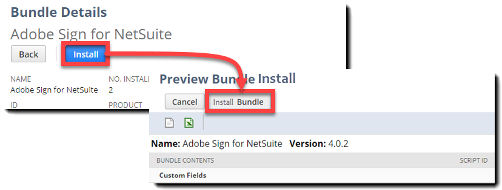
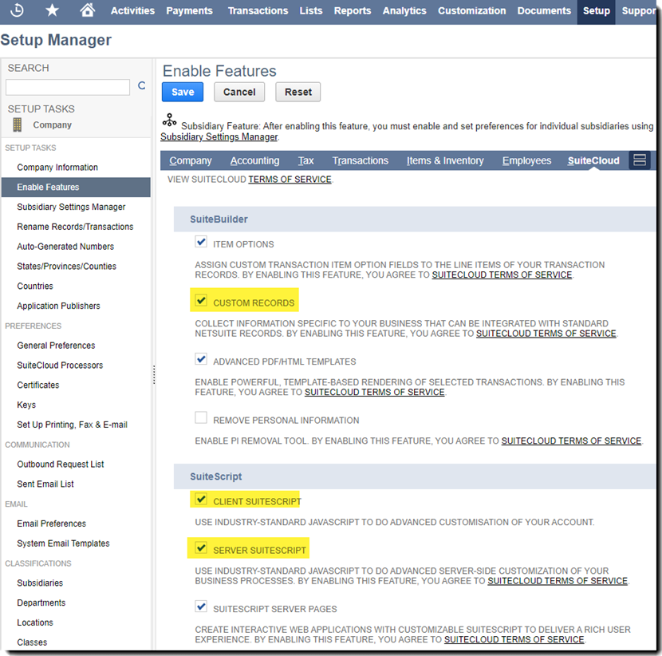
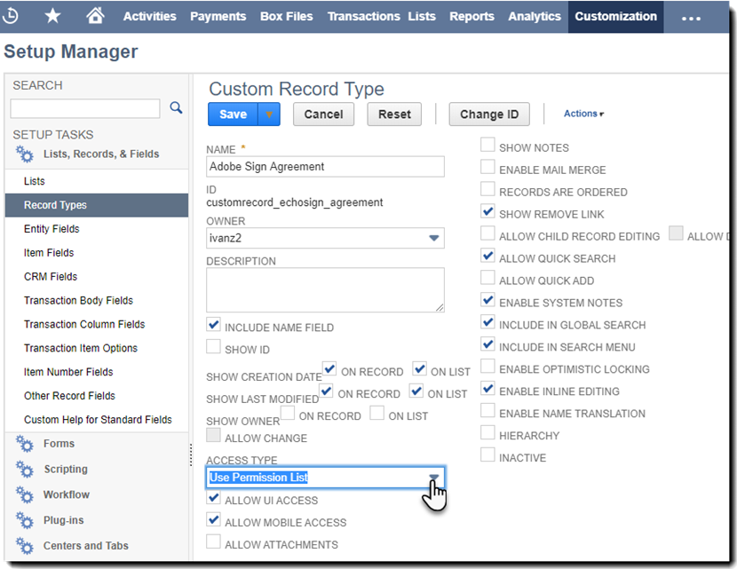
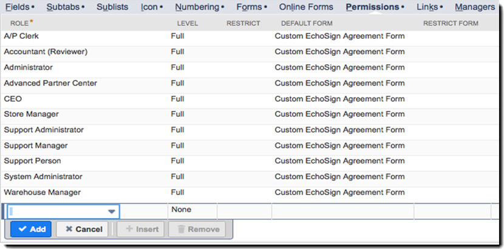

# Installatie- en aanpassingsgids voor Adobe Sign for NetSuite (v4.0.4){#install-customize-netsuite}

## Overzicht {#overview}

Adobe Sign for NetSuite biedt een volledige integratie van e-handtekeningen met NetSuite. U kunt de integratie van Adobe Sign for Netsuite gebruiken om overeenkomsten, zoals contracten, offertes en andere documenten, waarvoor elektronische handtekeningen zijn vereist, rechtstreeks vanuit NetSuite naar ontvangers te verzenden. U kunt Adobe Sign-overeenkomsten maken en verzenden van klanten, leads, offertes en andere NetSuite-records. Adobe Sign werkt NetSuite bij met de huidige status van overeenkomsten en slaat de overeenkomsten op met de gekoppelde NetSuite-records zodra ze volledig zijn uitgevoerd. U kunt de geschiedenis bekijken van alle overeenkomsten die vanuit NetSuite vanuit het product zijn verzonden.

Raadpleeg de [Opmerkingen bij de release van Adobe Sign for NetSuite](https://experienceleague.corp.adobe.com/docs/sign-integrations/using/netsuite/release-notes.html?lang=en) voor meer informatie.

## Installeer de bundel en configureer OAuth {#install}

Alleen een NetSuite-beheerder kan de bundel installeren of bijwerken. Om OAuth te configureren, moet de NetSuite-beheerder beheerdersrechten hebben voor Adobe Sign. Voordat u de bundel in uw Productieaccount installeert, moet u de bundel installeren en testen in een NetSuite Sandbox-account.

Zie [Een Adobe Sign-overeenkomst maken](#createagreement) voor meer informatie over testen.

>[!CAUTION]
>
>Klanten die een upgrade uitvoeren naar v4.0.4, mogen hun bestaande API-sleutel NIET verwijderen.
>
>Zie [Aangepaste voorkeuren instellen](#configure) voor meer informatie over het gebruik van de API-sleutel.

### Installeer de bundel voor de eerste keer

1. Navigeer naar **Customization > SuiteBundler > Search &amp; Install Bundles**.

1. Typ **Adobe Sign** als trefwoord op de pagina *Bundels zoeken en installeren* en selecteer **Zoeken**.

1. Selecteer de **Adobe Sign** bundelnaam.

   

1. Selecteer **Installeren** op de pagina *Bundlegegevens*.
1. Selecteer **Bundel installeren** op de pagina *Voorvertoning bundel installeren*.

   (De standaardwaarden op de pagina hoeven niet te worden gewijzigd)

   

1. Selecteer **OK** in het dialoogvenster Installeren om door te gaan.

   Tijdens het installatieproces wordt de status van de bundel weergegeven als *In behandeling*.

   

1. Selecteer **Vernieuwen** om een bijgewerkte status weer te geven.

   Nadat de bundelinstallatie is voltooid, wordt *Adobe Sign for NetSuite* weergegeven op de pagina *Geïnstalleerde bundels*.

   

1. Als u al een Adobe Sign-klantaccount hebt, volgt u de stappen om [OAuth te configureren na installatie of upgrade](#oauth).

   Als u geen Adobe Sign-account hebt, kunt u [zich aanmelden voor een Enterprise trial](https://esign.adobe.com/adobe-sign-netsuite-trial-registration.html)-account om het systeem te testen. Volg de online registratiestappen om uw Adobe Sign-account in te schakelen.

## OAuth configureren na installatie of upgrade {#oauth}

Adobe Sign gebruikt OAuth 2.0 om uw Adobe Sign-account binnen NetSuite te verifiëren.

Dit protocol machtigt uw geïnstalleerde NetSuite-bundel te communiceren met Adobe Sign zonder uw wachtwoord aan te vragen. Aangezien gevoelige informatie niet rechtstreeks tussen de apps gedeeld wordt, is het minder waarschijnlijk dat derden toegang tot uw account krijgen.

Deze verificatie heeft geen invloed op uw implementatie, maar u moet een eenmalige configuratie uitvoeren nadat u de bundel hebt geïnstalleerd of bijgewerkt in uw productie- of Sandbox-account.

De NetSuite-beheerder die OAuth configureert, moet ook beheerdersrechten op accountniveau hebben voor Adobe Sign.

1. Navigeer in NetSuite naar de lijstpagina *Adobe Sign Config*.

1. Zoek naar **Adobe Sign Config** (een aangepast recordtype) met behulp van het veld Zoeken in de koptekst.

1. Selecteer op de pagina Zoekresultaten **Weergave** voor de *Adobe Sign Config*-record.

   

1. Selecteer op de pagina Adobe Sign Config de optie **Weergave** voor de *OAuth gebruiken om toegang te krijgen tot Adobe Sign API&#39;s*-record.

   

1. Selecteer **Aanmelden met Adobe Sign** op de pagina Adobe Sign Config

   

1. Op de Adobe Sign-aanmeldingspagina die wordt weergegeven, voert u uw gegevens in en selecteert u **Aanmelden**.

   

1. Selecteer **Toegang toestaan** op de pagina Toegang bevestigen (voor OAuth) die wordt weergegeven

   

1. Wanneer de autorisatie is voltooid, wordt u in NetSuite teruggeleid naar de Adobe Sign Config-pagina, zoals hieronder wordt weergegeven.

   

   >[!NOTE]
   >
   >Als u OAuth configureert in uw Sandbox-account, krijgt u de fout &quot;Kan de klant niet bepalen wanneer de verificatie is voltooid&quot; te zien.
   >
   >
   >Als u wilt doorgaan, moet u het accountdomeingedeelte van de URL (system.netsuite.com) in uw browser wijzigen om als volgt terug te verwijzen naar de NetSuite-sandbox:
   >
   >
   >Wijzigen:
   >
   >
   >system.netsuite.com/app/site/hosting/scriptlet.nl?script=745&amp;deploy=1&amp;web_access_point=https://echosign.com
   >
   >
   >Aan:
   >
   >
   >systeem.**sandbox.**netsuite.com/app/site/hosting/scriptlet.nl?script=745&amp;deploy=1&amp;web_access_point=https://echosign.com

## De bundel (bestaande gebruikers) bijwerken

NetSuite-bundelupdates worden regelmatig door Adobe uitgebracht. Bestaande gebruikers van de Adobe Sign for NetSuite-integratie kunnen een update uitvoeren naar de nieuwste bundel.

>[!CAUTION]
>
>Klanten die een upgrade uitvoeren naar een nieuwere versie, mogen hun bestaande API-sleutel NIET verwijderen.
>
>Zie [Aangepaste voorkeuren instellen](#configure) voor meer informatie over het gebruik van de API-sleutel.

### Vereisten {#prerequisites}

De tijd die nodig is om de versie 4.0.4-bundel bij te werken, is afhankelijk van het aantal overeenkomsten met de status Verzonden ter ondertekening. Meestal duurt het 7 tot 10 minuten om 100 overeenkomsten bij te werken. Houd rekening met het aantal records waarmee u de updatetijd inschat.

Bepaal het aantal overeenkomsten dat ter ondertekening is verzonden:

1. Navigeer naar **Aanpassing > Lijsten, records en bestanden > Recordtypen** en zoek *Adobe Sign-overeenkomst.*

   Of zoek in de zoekbalk naar Adobe Sign-overeenkomsten.

1. Selecteer **Zoeken** voor de record Adobe Sign-overeenkomsten.

   

1. Selecteer **Verzonden voor ondertekening** in de vervolgkeuzelijst **Status** en selecteer vervolgens **Verzenden**.

   

   Houd rekening met het aantal records waarmee u de updatetijd inschat.

   

### De bundel bijwerken {#updating-the-bundle}

1. Navigeer naar **Customization > SuiteBundler > Search &amp; Install > List** en zoek de huidige bundel, zoals hieronder weergegeven.

   >[!NOTE]
   >
   >Als er een nieuwe versie van de bundel is, wordt rechts van het *versienummer* van uw huidige bundel een uitroepteken weergegeven.

1. Selecteer **Bijwerken** in het vervolgkeuzemenu Actie.

   

1. Selecteer **Bundel bijwerken** bijwerken op de pagina Voorvertoning bundelupdate zonder een van de standaardwaarden te wijzigen die op de pagina worden weergegeven.

   Tijdens de installatie wordt de status van de bundel weergegeven als *In behandeling*.

   .

   >[!NOTE]
   >
   >Wanneer u de bundel bijwerkt, krijgt u mogelijk een waarschuwingsbericht zoals hieronder weergegeven. Als u de NetSuite-records voor elektronische handtekeningen niet hebt aangepast, kunt u doorgaan. Als u niet zeker weet, kunt u de bundel het best op een Sandbox-account installeren om deze eerst te testen voordat u de bundel in een productieaccount bijwerkt.
   

1. Selecteer **Vernieuwen** om een bijgewerkte status weer te geven.

   

   >[!NOTE]
   >
   >Als de update lang lijkt te duren omdat u een groot aantal overeenkomsten *Verzonden voor ondertekening* hebt, kunt u het **Subtabblad Logboek voor uitvoering** controleren op het *script voor de installatie van de Adobe Sign-bundel* om de voortgang van uw update te bepalen. (Zie [De voortgang van de update bepalen](#determineprogress)voor meer informatie.)

   Nadat de bundelupdate is voltooid, wordt *Adobe Sign for NetSuite* weergegeven op de pagina *Geïnstalleerde bundels*.

   

## De bundel configureren {#configure}

### Aangepaste voorkeuren instellen  {#set-custom-preferences}

U kunt aangepaste voorkeuren gebruiken om op te geven hoe overeenkomsten worden gemaakt en opgeslagen in NetSuite. Daarnaast kunt u met de *Voorkeuren voor het automatisch toewijzen van gebruikers in Adobe Sign* opgeven of NetSuite-gebruikers automatisch worden ingericht in Sign-services wanneer ze overeenkomsten verzenden vanuit NetSuite.

1. Navigeer naar **Setup > Bedrijf > Algemene voorkeuren**.
1. Schuif omlaag op de pagina en selecteer vervolgens het subtabblad **Aangepaste voorkeuren**.

   

1. Schakel uw Adobe Sign-voorkeuren naar wens in en configureer ze:

   * **Voer de EchoSign API-sleutel voor uw account** in: Voeg in dit veld geen waarde toe of bewerk deze.
   * **Contactpersoon bovenliggende record gebruiken als ondertekenaar**: Indien ingeschakeld, wordt de contactpersoon voor de bovenliggende record standaard ingesteld als de eerste ondertekenaar bij het maken van overeenkomsten. De afzender kan de standaardondertekenaar gemakkelijk verwijderen of bewerken of extra ondertekenaars aan de overeenkomst toevoegen voordat hij de overeenkomst verzendt.
   * **Gebruik Trans. Contact opnemen als ondertekenaar indien aanwezig**: Deze voorkeur is alleen geldig als de voorkeur *Contact opnemen met bovenliggende record gebruiken als ondertekenaar* ook is ingeschakeld. Als deze optie is ingeschakeld, wordt bij het genereren van een overeenkomst op basis van een transactierecord (bijvoorbeeld Offerte) de primaire contactpersoon voor transacties standaard ingesteld als de eerste ondertekenaar. (Zie [Transactierecords](#transrecords)voor meer informatie.) Als er geen primaire contactpersoon voor transacties is, of als er een bericht wordt verzonden vanuit een NetSuite-objectrecord (bijvoorbeeld Klantrecord, partnerrecord), is de standaardopnemer de primaire contactpersoon voor de e-mail van de klant. De afzender kan de standaardondertekenaar gemakkelijk verwijderen of bewerken of extra ondertekenaars aan de overeenkomst toevoegen voordat hij de overeenkomst verzendt.
   * **Ontvangers als goedkeurders** markeren toestaan: Indien ingeschakeld kunnen afzenders ontvangers markeren als fiatteurs. Als fiatteurs gemarkeerde ontvangers kunnen overeenkomsten reviseren en goedkeuren, maar ze zijn niet verplicht ze te ondertekenen. Fiatteurs kunnen worden verplicht gegevens in velden in te voeren tijdens het goedkeuringsproces.
   * **Voorkeursmap-id** voor overeenkomst: Wordt gebruikt om de map op te geven waarin de uiteindelijke ondertekende overeenkomsten worden opgeslagen. Als u voor dit veld geen waarde instelt, worden de uiteindelijke ondertekende overeenkomsten standaard opgeslagen in dezelfde map als het oorspronkelijke documentbestand. De map-id moet een getal zijn.
   * **Transactie-PDF** automatisch bijvoegen: Indien ingeschakeld worden transactie-PDF&#39;s automatisch aan overeenkomsten gekoppeld wanneer nieuwe overeenkomsten worden gemaakt op basis van transactierecords.
   * **Ondertekende PDF toevoegen als (bijlage of koppeling)**: Als  ** List is geselecteerd in de vervolgkeuzelijst, wordt de ondertekende PDF automatisch toegevoegd als een koppeling naar het bestand. Als *Bijlage* is geselecteerd in de vervolgkeuzelijst, wordt de ondertekende PDF in NetSuite opgeslagen als een bijlage in de overeenkomstrecord.
   * **PDF van audittrail opnemen bij overeenkomst**: Als deze optie is ingeschakeld, worden PDF&#39;s van audittrails automatisch toegevoegd aan overeenkomstrecords nadat de overeenkomsten zijn ondertekend.
   * **Identiteitsverificatiemethode is van toepassing op**: Als u een van de methoden voor identiteitsverificatie inschakelt, bepaalt u aan wie de identificatiemethode wordt toegepast. De opties zijn *Alle ondertekenaars, Alleen externe ondertekenaars, *of *Alleen interne ondertekenaars*.

   **Methoden voor identiteitsverificatie** {#identity-verification-methods}

   Ingeschakelde identiteitsverificatiemethode(n) kunnen worden geselecteerd bij het maken van een overeenkomst. Als hier meer dan één methode voor identiteitsverificatie is ingeschakeld, wordt op de pagina Adobe Sign-overeenkomst de optie **Identiteit ondertekenaar** weergegeven.

   * **Schakel het vereiste wachtwoord in om te ondertekenen**: Vereisen dat ondertekenaars een eenmalig wachtwoord invoeren dat u opgeeft.

   * **Verificatie** op basis van kennis inschakelen: Verplicht ondertekenaars om hun naam, adres en optioneel de laatste vier cijfers van hun burgerservicenummer op te geven en vervolgens een lijst met vragen te beantwoorden ter verificatie van de informatie die ze hebben verstrekt. Alleen beschikbaar in de Verenigde Staten.

   * **Schakel webidentiteitsverificatie** in: Vereisen dat ondertekenaars hun identiteit verifiëren door zich aan te melden bij een van de volgende sites: Facebook, Google, LinkedIn, Microsoft Live, Twitter of Yahoo!

   * **Gebruiker automatisch toewijzen in Adobe Sign**: Als deze optie is ingeschakeld, worden gebruikers die overeenkomsten verzenden in NetSuite automatisch toegewezen aan een Adobe Sign-gebruikersaccount.

1. Selecteer **Opslaan** om uw voorkeuren op te slaan.

## Automatische statusupdates configureren {#asu}

Met de Adobe Sign-integratiebundel kunt u automatisch updates in NetSuite ontvangen over de status van de overeenkomsten die vanuit NetSuite zijn verzonden. Als deze functie is ingeschakeld, geeft NetSuite altijd de huidige status van uw overeenkomsten weer. U kunt automatische statusupdates als volgt inschakelen:

1. Navigeer naar **Setup > Bedrijf > Functies inschakelen.**
1. Selecteer het subtabblad **SuiteCloud**.
1. Schakel de volgende opties in:

   * Schakel in het gedeelte SuiteBuilder de optie **Aangepaste records** in.

   * Schakel in de sectie SuiteScript de opties **Client SuiteScript** en **Server SuiteScript** in en ga akkoord met de servicevoorwaarden voor beide.

1. Selecteer **Opslaan**.

   Uw opties worden ingesteld zoals weergegeven in de afbeelding.

   

## Objecten en recordtypen {#objects}

De Adobe Sign-integratiebundel maakt het Adobe Sign Agreement-object al toegankelijk met vele standaard NetSuite-objecten, waaronder: Klant, Schatting, Lead, Opportunity en Partner-records. U kunt de Adobe Sign-bundel ook gebruiken met andere recordtypen, waaronder aangepaste records.

Het tabblad Overeenkomst kan worden weergegeven met twee typen NetSuite-records: Entiteits- en transactieregisters. We gaan er doorgaans van uit dat een transactierecord een record is (zoals een citaat) dat kan worden geconverteerd naar een PDF-document; terwijl een entiteitsrecord niet kan worden geconverteerd naar een PDF.

## Transactierecords {#transrecords}

Als de overeenkomst is gemaakt op basis van een transactierecord, is het eerste document in de overeenkomstrecord de PDF-versie van de record waaruit de overeenkomst afkomstig is en is de eerste ontvanger het e-mailadres van de record. Als u niet wilt dat het eerste document een PDF-versie is van de record waaruit het afkomstig is, gaat u naar **Setup > Bedrijf > Algemene voorkeuren > Aangepaste voorkeuren subtabblad** en schakelt u de optie **Transactie-PDF automatisch koppelen** uit. Zie [Aangepaste voorkeuren instellen](#configure) voor meer informatie.

Onder Aangepaste voorkeuren kunt u ook de optie **Trans gebruiken inschakelen. Neem contact op met de voorkeur Eerste ondertekenaar** als u wilt dat de primaire transactiecontrole automatisch wordt toegevoegd als de eerste ondertekenaar. Als de record is gekoppeld aan een transactierecord, worden de **Overeenkomsten** en de **Send for Signature** knoppen weergegeven.

## Entiteitsrecords {#entity-records}

Als de overeenkomst is gemaakt op basis van een entiteitsrecord, is de eerste ontvanger het e-mailadres uit de record. Wanneer deze aan een entiteitrecord is gekoppeld, wordt alleen het tabblad Overeenkomsten weergegeven.

## De bundel aanpassen {#customize}

Het aanpassen van de bundel omvat het volgende:

* De scripts voor het subtabblad Overeenkomsten en de knop Send for Signature voor de juiste recordtypen implementeren.
* Rolmachtigingen instellen voor uw Adobe Sign-recordtypen.
* Bevoegdheden wijzigen om toegang te verlenen tot de *subtab Overeenkomsten* en de *knop Send for Signature*.

### Adobe Sign-overeenkomsten configureren voor extra recordtypen  {#configuring-adobe-sign-agreements-for-additional-record-types}

Implementeer de *subtab Overeenkomsten* en de knop *Send for Signature* voor de juiste recordtypen:

1. Navigeer naar **Aanpassing > Scripts > Scripts.**

1. Zoek op de pagina *Scripts* in de lijst het script dat u wilt implementeren en selecteer vervolgens **Weergave**.

   * Als u de knop *Send for Signature* wilt toevoegen, selecteert u **Adobe Sign Estimate Button**-script.

   * Als u het tabblad *Overeenkomsten* wilt toevoegen, selecteert u **Adobe Sign-overeenkomstLoader**-script.

1. Selecteer **Script implementeren** op de scriptpagina.

   

1. Ga als volgt te werk op de pagina Scriptimplementatie:

   * Selecteer het type record in de lijst *Toepassen op*.
   * Voer desgewenst de implementatie-id voor het script in.

      Raadpleeg het onderwerp *Creating a Custom Script Deployment ID* in het Help Center van NetSuite voor meer informatie. Als u geen id opgeeft, wordt er een gegenereerd.

   * Schakel het selectievakje **Gedistribueerd** in.

   

   * Stel *Status* in op **Release**.

      U hoeft geen *gebeurtenistype* of *Logniveau* op te geven.

   * Selecteer **Uitvoeren als beheerder** in de vervolgkeuzelijst *Uitvoeren als beheerder.*

   * Als het subtabblad **Soorten publiek** actief is (standaard actief), selecteert u de specifieke rollen of gebruikers aan wie u toegang wilt verlenen. Als u toegang wilt verlenen tot alle rollen en gebruikers, schakelt u de respectieve **opties Alle selecteren** in.

   * Selecteer **Opslaan**. Als de wijzigingsbevestiging wordt weergegeven, selecteert u **Terug**.

1. Selecteer **List** boven aan de pagina Scriptimplementatie om terug te gaan naar de lijstpagina *Scripts*.
1. Herhaal de stappen 2 en 3 hierboven voor het andere script.

## Rolmachtigingen instellen voor Adobe Sign-recordtypen  {#setting-role-permissions-for-adobe-sign-record-types}

De meeste NetSuite-rollen moeten toestemming hebben om Adobe Sign te gebruiken zonder aanvullende aanpassingen. Het kan echter zijn dat u machtigingen moet verlenen voor extra aangepaste rollen die zijn gemaakt.

1. Navigeer naar **Aanpassing > Lijsten, records en bestanden > Recordtypen**.

   

   >[!NOTE]
   >
   >Als u het item *Recordtypen* niet ziet, navigeert u naar **Setup > Bedrijf > Functies inschakelen > tabblad Suite Cloud** en schakelt u de optie *Aangepaste records* in.

1. Selecteer **Adobe Sign Agreement** op de pagina *Recordtypen* om deze te selecteren

   

1. Selecteer op de pagina *Aangepast recordtype* **Machtigingenlijst gebruiken** in de vervolgkeuzelijst *Toegangstype*.

   

   >[!NOTE]
   >
   >Het recordtype *Adobe Sign Agreement* is het enige Adobe Sign-recordtype waarvoor het toegangstype *Gebruikt machtigingslijst* is vereist.
   >
   >
   >Zie stap 6 voor instructies voor het instellen van het toegangstype voor de andere Adobe Sign-recordtypen.

1. Selecteer het subtabblad **Machtigingen**.

   De lijst met rollen en machtigingen wordt weergegeven.

   

1. Stel de machtigingen als volgt in voor de extra aangepaste rollen die zijn toegevoegd aan het recordtype &quot;Adobe Sign Agreement&quot;.

   >[!NOTE]
   >
   >Zie het onderwerp *[Een machtigingenlijst instellen voor een aangepast recordtype](https://system.netsuite.com/app/help/helpcenter.nl?fid=section_N2879931.html)* in het Help Center van NetSuite voor meer informatie

   1. Selecteer de rol in de lijst *Rol*.
   1. Stel *Niveau* in op **Volledig**
   1. Stel *Standaardformulier* in op **Aangepast EchoSign-overeenkomstformulier**
   1. selecteren om het selectievakje *Formulier beperken* te controleren
   1. selecteer **Toevoegen** om de wijzigingen voor de rollenrij op te slaan

   

   De nieuwe rij wordt weergegeven zoals hieronder weergegeven:

   

   Herhaal de stappen a tot en met e hierboven voor alle extra aangepaste rollen.

   * Selecteer **Opslaan** op de pagina *Aangepast recordtype* wanneer machtigingen voor alle rollen zijn ingesteld.

   De pagina *Klantrecordtype* wordt opnieuw weergegeven.

1. Herhaal de stappen 1 tot en met 3 hierboven om *Toegangstype* voor alle andere Adobe Sign-recordtypen in te stellen op

   **Geen toestemming vereist.** Dit is van toepassing op de volgende recordtypen:

   * Adobe Sign Config
   * Adobe Sign-document
   * Adobe Sign-gebeurtenis
   * Adobe Sign Language
   * Adobe Sign-scriptfouten
   * Door Adobe Sign ondertekende overeenkomst
   * Adobe Sign Signer

### Toegang verlenen tot het tabblad Overeenkomst en de knop Send for Signature  {#granting-access-to-the-agreement-tab-and-send-for-signature-button}

De Adobe Sign-integratiebundel maakt het Adobe Sign Agreement-object al toegankelijk met vele standaard NetSuite-objecten (Klant, Schatting [Offerte], Lead, enz.). Het subtabblad *Overeenkomst* wordt automatisch ingeschakeld voor de volgende typen objecten: Klant, Lead, Opportunity, Partner, Prospect, Offerte en Bill van leverancier.

De *Send for Signature* knop wordt automatisch ingeschakeld **alleen voor het Offerteobject**.

NetSuite-beheerders kunnen de mogelijkheid uitbreiden om overeenkomsten te maken met aanvullende CRM-objecten door machtigingen te wijzigen om de *subtab Overeenkomst*, *knop Send for Signature* of beide toe te voegen aan deze objecten.

#### Machtigingen wijzigen om toegang te verlenen tot de knop Send for Signature  {#modifying-permissions-to-grant-access-to-the-send-for-signature-button}

1. Navigeer naar **Aanpassing > Scripts > Scripts**.

   De lijstpagina *Scripts* wordt weergegeven.

   * Gebruik indien nodig de filters om de Adobe Sign-scripts te zoeken

1. Zoek op de pagina *Scripts* het script *Adobe Sign Estimate Button* (bestuurt de knop *Send for Signature*) en selecteer vervolgens **View**.

   

1. Ga als volgt te werk op de pagina *Script*:

   * het subtabblad **Implementaties** selecteren

   * Onder &quot;*Van toepassing op*&quot; selecteert u de koppeling voor de entiteit die u wilt wijzigen

      * **** Citaat in dit voorbeeld

   

   * Selecteer de **Edit**-knop op de pagina *Script Deployment*

   

   * Activeer het subtabblad **Soorten publiek** en selecteer de specifieke rollen of gebruikers aan wie u toegang wilt verlenen.

      * Als u toegang wilt verlenen tot alle rollen en gebruikers, schakelt u de respectieve **opties voor het selecteren van alle** in
   * selecteer **Opslaan**

   

#### Machtigingen wijzigen om toegang te verlenen tot het tabblad Overeenkomsten  {#modifying-permissions-to-grant-access-to-the-agreements-tab}

1. Navigeer naar **Aanpassing > Scripts > Scripts**
1. Zoek op de pagina *Scripts* het script *Adobe Sign Agreement Loader* (bestuurt het tabblad *Overeenkomsten*)

   * selecteren **Weergave**

1. Ga als volgt te werk op de pagina *Script*:

   1. het subtabblad **Implementaties** selecteren
   1. Onder &quot;*Van toepassing op*&quot; selecteert u de koppeling voor de entiteit waarvoor u de toegang wilt wijzigen
   1. Selecteer op de *Script-implementatiepagina de knop **Bewerken**

   1. Als het subtabblad **Doelgroep** actief is (het is standaard actief), selecteert u de specifieke rollen of gebruikers waartoe u toegang wilt verlenen. Als u toegang wilt verlenen tot alle rollen en gebruikers, schakelt u de respectieve **opties voor het selecteren van alle** in

   1. selecteer **Opslaan**

## De Adobe Sign for NetSuite-bundel gebruiken

Gebruikers kunnen alleen overeenkomsten van NetSuite verzenden en updates over deze overeenkomsten ontvangen als ze over dezelfde aanmeldings-id (e-mailadres) in NetSuite en in Adobe Sign beschikken.

### Een Adobe Sign-overeenkomst maken

Nadat u een nieuwe bundel in een Sandbox- of Productieaccount hebt geïnstalleerd, moet u de bundel testen door een nieuwe overeenkomst te maken. U kunt Adobe Sign-overeenkomsten maken op basis van een entiteitrecord, op basis van een transactierecord of als een zelfstandige overeenkomst.

>[!NOTE]
>
>Het proces voor het maken van een overeenkomst verschilt enigszins afhankelijk van de manier waarop de overeenkomst is gemaakt. Het algemene proces bestaat uit het opgeven van de opties voor uw overeenkomst, het toevoegen van een of meer overeenkomstdocumenten en het opgeven van de ontvangers. Bij het hieronder beschreven proces wordt ervan uitgegaan dat u de overeenkomst maakt op basis van een klantrecord.

1. Selecteer of maak een klantrecord waaruit u een overeenkomst wilt verzenden, of selecteer een ander NetSuite-recordtype waarvan het tabblad Overeenkomsten is ingeschakeld.

1. Selecteer in de record het subtabblad **Overeenkomsten**.
1. Selecteer **Nieuwe overeenkomst**.

   

1. Selecteer **Edit** op de pagina *Adobe Sign Agreement*.

   

1. Geef de opties voor uw overeenkomst als volgt op:

   * **Naam**  overeenkomst - Voer een naam in voor de overeenkomst.
   * **Bericht** - Voer een aangepast bericht in voor de ontvanger.
   * **Type**  handtekening - Selecteer het type handtekening dat is geaccepteerd voor het document. De opties zijn *e-handtekening* en *Handtekening faxen*.

   * **Ik moet deze overeenkomst**  ook ondertekenen - Schakel deze optie in om aan te geven dat de afzender de overeenkomst ook moet ondertekenen.
   * **Handtekeningvolgorde** - Als de optie  *Ik moet deze* overeenkomst ook ondertekenen is ingeschakeld, selecteert u de volgorde waarin de afzender en de ontvangers moeten ondertekenen. De opties zijn &quot;Ik onderteken, vervolgens ondertekenen ontvangers&quot;, &quot;Ontvangers ondertekenen, dan onderteken ik&quot; en &quot;Geen&quot;.

   * **Voorbeeld van document- of positiehandtekeningen (of formuliervelden)**  - Schakel deze optie in om verzenders in staat te stellen een voorvertoning van de overeenkomst weer te geven en om hen in staat te stellen velden (handtekening slepen en neerzetten, beginvelden en andere formuliervelden) aan de overeenkomst toe te voegen voordat deze naar ontvangers wordt verzonden.
   * **Identiteit**  ondertekenaar verifiëren - Schakel deze optie in en selecteer een van de volgende opties voor identiteitsverificatie

      * Deze optie wordt alleen weergegeven wanneer in de aangepaste voorkeuren meer dan een van de drie hieronder vermelde methoden voor identiteitsverificatie van ondertekenaars is ingeschakeld. (Zie [Aangepaste voorkeuren instellen](#customize) voor meer informatie.) Als slechts één voorkeur is ingeschakeld, wordt de optie **Identiteit ondertekenaar verifiëren** niet weergegeven.

   **Methoden voor identiteitsverificatie**

   * **Wachtwoord vereist om te ondertekenen**  - Verplicht ondertekenaars om een eenmalig wachtwoord in te voeren dat u opgeeft.
   * **Verificatie**  op basis van kennis - Verplicht ondertekenaars om hun naam, adres en optioneel de laatste vier cijfers van hun burgerservicenummer op te geven en beantwoord vervolgens een lijst met vragen ter verificatie van de informatie die ze hebben verstrekt. Alleen beschikbaar in de Verenigde Staten.
   * **Webidentiteitsverificatie**  - Vereist dat ondertekenaars hun identiteit verifiëren door zich aan te melden bij een van de volgende sites: Facebook, Google, LinkedIn, Twitter, Yahoo! of Microsoft Live.
   * **Wachtwoord vereist om PDF**  weer te geven - Schakel deze optie in om te vereisen dat een ontvanger een wachtwoord invoert voordat een PDF van de overeenkomst of de ondertekende overeenkomst wordt geopend. Het PDF-bestand dat naar iedereen wordt verzonden, wordt versleuteld en dit wachtwoord is vereist om het te openen. Raak uw wachtwoord niet kwijt omdat het niet kan worden teruggezet. Als u het wachtwoord verliest, moet u die transactie verwijderen en opnieuw beginnen.
   * **Wachtwoord/Wachtwoord**  bevestigen - Als de optie  *Wachtwoord vereist voor weergave van* PDF is ingeschakeld, voert u het wachtwoord in dat moet worden gebruikt om de overeenkomst weer te geven.
   * **Ontvangers eraan herinneren te tekenen**  - Geef op of en hoe vaak herinneringen naar ontvangers worden verzonden. De opties zijn *Nooit*, *Dagelijks* of *Wekelijks*.
   * **Taal:** Geef de taal op waarin de ondertekeningspagina en e-mailmeldingen aan de ontvangers worden weergegeven.
   * **Host tekent voor de eerste ondertekenaar**  - Schakel deze optie in om de persoonlijke ondertekenaar van de afzender toe te staan voor de eerste ondertekenaar.
   * **Dagen tot ondertekeningsdeadline**  - Voer een geheel getal in om de ondertekeningsdeadline voor de overeenkomst aan te geven (de datum van vandaag + het aantal dagen).
   * **Bovenliggende record**  - Selecteer desgewenst een bovenliggende record om deze te koppelen aan de overeenkomst.

   

1. Selecteer het tabblad **Documenten**.

   

1. Voeg op het subtabblad *Documenten* een bestaand document uit de bestandscabinet bij met de vervolgkeuzelijst *Adobe Sign-document* en selecteer **Bijvoegen**.

   U kunt ook op **Nieuw Adobe Sign-document** klikken om toegang te krijgen tot de pagina *Adobe Sign-document* en vervolgens de naam van een document in uw NetSuite-bestandscabinet typen, bestanden in uw transactierecord selecteren (indien van toepassing) of een nieuw document bijvoegen.

   U kunt meerdere documenten aan een overeenkomst toevoegen.

1. Selecteer het subtabblad **Ontvangers** en geef de ontvanger op door deze te selecteren in de lijst met contactpersonen of door een e-mailadres te typen.

   

   Elk van uw ontvangers kan worden gemarkeerd als Ondertekenaar of CC. Als de aangepaste voorkeur *Ontvangers van markering toestaan als ondertekenaars van goedkeurders* is ingeschakeld, kunnen ontvangers ook worden gemarkeerd als fiatteurs. Zie [Aangepaste voorkeuren instellen](#customize) voor meer informatie.

   * **De** ondertekenaars moeten de overeenkomst ondertekenen.
   * **** Fiatteurs moeten de overeenkomst goedkeuren, maar niet ondertekenen en moeten eventueel gegevens aan een overeenkomst toevoegen.
   * **CC&#39;s** Ontvangers worden op de hoogte gesteld van updates van overeenkomsten en wanneer de overeenkomst is ondertekend en voltooid. CC-ontvangers zijn geen partij bij het ondertekenings- of goedkeuringsproces.

      Als de aangepaste voorkeur *Contact opnemen met bovenliggende record gebruiken als ondertekenaar* alleen of in combinatie met de aangepaste voorkeur *Trans gebruiken is ingeschakeld. Contact opnemen als ondertekenaar*, voorkeur, de eerste ontvanger wordt standaard ingesteld, maar kan worden gewijzigd.

1. Selecteer **Toevoegen** na het invoeren van elke ontvanger.

1. Selecteer **Opslaan** om de overeenkomst op te slaan.

### Overeenkomsten verzenden ter ondertekening

Als de overeenkomst klaar is om te worden verzonden, selecteert u de knop **Send for Signature**.

* Als de optie *Voorvertoning van document of positie handtekeningen* is ingeschakeld, klikt u op **Send for Signature**. Geef in het venster dat wordt geopend een voorvertoning van het document weer of sleep formuliervelden naar het document voordat het wordt verzonden. Selecteer **Verzenden** om de overeenkomst naar de ontvanger te verzenden.

* Als de optie *Host Signing for First Signer* is ingeschakeld, klikt u op **Send for Signature**. In het venster dat wordt geopend, kan de ondertekenaar het document ondertekenen met de afzender.

   Er verschijnt een koppeling *Host Signing for Current Signer* ook naast het veld *Host Signing for First Signer*, dat kan worden geopend totdat het document is ondertekend. Gebruik deze koppeling om het ondertekenen van overeenkomsten voor meerdere ondertekenaars te hosten of om het pop-upvenster opnieuw te openen als het per ongeluk is gesloten.

Zodra de overeenkomst is verzonden, ontvangen de ontvangers een e-mail waarin ze op de hoogte worden gesteld van de documenten die op hun handtekening wachten.

Nadat de ontvangers het document hebben ondertekend, ontvangt de afzender per e-mail een melding dat het document is ondertekend.

#### Verzenden vanuit een offerte

Adobe Sign is rechtstreeks geïntegreerd met aanhalingstekens in NetSuite, zodat er automatisch een PDF van de offerte wordt gegenereerd en als bijlage aan de overeenkomstrecord wordt toegevoegd.

Selecteer **Send for Signature** bij het weergeven van een offerte. De offerte die aan de overeenkomst is gekoppeld, wordt gegenereerd en weergegeven. U kunt ook de knop *Send for Signature* toevoegen aan andere typen transactierecord. Zie [Objecten en recordtypen](#objects)voor meer informatie.

### Status bijhouden en herinneringen verzenden

Nadat u een overeenkomst hebt verzonden:

* De documentstatus verandert in *Verzonden voor ondertekening* in de sectie Overeenkomstdetails
* De knop *Send for Signature* wordt vervangen door de volgende drie knoppen:

   * **Status**  bijwerken - Selecteer deze knop om de status handmatig bij te werken als er geen statusupdates zijn geconfigureerd. Zie [Automatische statusupdates configureren](#asu)voor meer informatie.
   * **Herinnering**  verzenden - Selecteer deze knop om een herinnering naar de huidige ondertekenaar te verzenden.
   * **Overeenkomst**  annuleren - Selecteer deze knop om een overeenkomst te annuleren. Een overeenkomst kan worden geannuleerd nadat deze ter ondertekening is verzonden als alle ontvangers nog niet hebben ondertekend.

Er wordt een nieuwe *Subtab Gebeurtenissen* weergegeven in de overeenkomstrecord waarin u de status van de overeenkomst kunt volgen.

U kunt een geschiedenis van de overeenkomstgebeurtenissen zien, met informatie over het moment waarop de overeenkomst is verzonden, bekeken en ondertekend.

Nadat de overeenkomst is ondertekend:

* De status verandert in *Ondertekend*.
* U kunt via de koppeling terugkoppelen naar de bovenliggende record voor deze overeenkomst.
* U kunt de &quot;download&quot;-koppelingen onder Ondertekend document en Audittrail gebruiken om toegang te krijgen tot deze documenten.
* Een extra *Ondertekend document* subtabblad wordt weergegeven om miniaturen van het ondertekende document weer te geven.

>[!NOTE]
>
>Nadat een overeenkomst ter ondertekening is verzonden, kunt u de record niet meer bewerken. Hiermee behoudt u het overzicht met gebeurtenissen.

## De bundel verwijderen

Volg de stappen in de Help bij NetSuite om de bundel te verwijderen. Zie het onderwerp *[Een bundel verwijderen](https://docs.oracle.com/cloud/latest/netsuitecs_gs/NSBDL/NSBDL.pdf)* in het Help Center van NetSuite voor meer informatie.

Wanneer u de bundel verwijdert, worden de niet-ondertekende overeenkomsten verwijderd. Dit heeft geen invloed op de ondertekende overeenkomsten en de bijbehorende PDF-auditbestanden.

Verwijder de bundel NIET als u de niet-ondertekende overeenkomsten moet behouden.

## Problemen oplossen

### De voortgang van de update bepalen

Als de update langer lijkt te duren dan is aangegeven, kunt u op het subtabblad Uitvoeringslogboek van het installatiescript voor Adobe Sign Bundle als volgt de voortgang van uw update bepalen:

1. Navigeer naar **Aanpassing > Scripts > Scripts**.
1. Zoek op de pagina *Scripts* het script *Adobe Sign-bundelinstallatie* en selecteer **Bewerken**.
1. Selecteer op de pagina *Script* het subtabblad **Uitvoeringslogbestand**.
1. Selecteer **Vernieuwen**.

   Het uitvoeringslogboek wordt bijgewerkt om de huidige status weer te geven. In de kolom *Details* ziet u de voortgang van de updates voor uw overeenkomsten.

   

### Problemen met toegangstoken oplossen

Er kan een bericht verschijnen met de melding dat het toegangstoken ongeldig of verlopen is wanneer u met overeenkomsten werkt.

Dit kan om de volgende redenen voorkomen:

* De NetSuite/Adobe Sign-beheerder die OAuth heeft geconfigureerd, heeft het toegangstoken ingetrokken
* De toegangstoken is verlopen omdat er in de afgelopen 60 dagen geen overeenkomsten zijn verzonden vanuit NetSuite
* De NetSuite/Adobe Sign-beheerder heeft de eerste OAuth-configuratie niet voltooid

U kunt dit probleem oplossen door het OAuth-configuratieproces opnieuw uit te voeren. Zie [OAuth configureren na installatie of upgrade](#oauth) voor meer informatie.

### Documentstatusproblemen oplossen {#resolvestatus}

Als [automatische statusupdates](#asu) zijn geconfigureerd, maar de overeenkomststatus niet wordt bijgewerkt na het verzenden van overeenkomsten, probeert u het volgende:

1. Controleer het implementatielogboek voor het script *Adobe Sign External Update* om te zien of u als volgt aanroepen van Adobe Sign ontvangt:

   1. Navigeer naar **Aanpassing > Scripts > Scriptimplementaties**
   1. Zoek op de pagina *Scriptimplementaties* het *Adobe Sign External Update* en selecteer **Edit**
      1. Selecteer op de pagina *Scriptimplementatie* het subtabblad **Uitvoeringslogbestand**.
      * U moet een *Bijgewerkte overeenkomstrecord*-item zien voor elke overeenkomst-id

1. Controleer het implementatielogboek voor het script *Adobe Sign Update agreements* om te zien of er fouten optreden als volgt:

   1. Navigeer naar **Aanpassing > Scripts > Scriptimplementaties**.
   1. Zoek op de pagina *Scriptimplementaties* het script *Adobe Sign-updateovereenkomsten* met de status &quot;Gepland&quot; en selecteer **Bewerken**.
   1. Selecteer op de pagina *Scriptimplementatie* het subtabblad **Uitvoeringslogbestand**.
   1. Selecteer **Error** onder *Type* om de resultaten te filteren.

1. Controleer ten slotte het uitvoeringslogbestand voor het script *Adobe Sign Manager* op fouten door de instructies in stap 2 hierboven te volgen.

### MIME-typefouten oplossen  {#resolving-mime-type-errors}

Als er een MIME-typefout optreedt bij het verzenden van een overeenkomst, kan dit komen doordat de naam in het veld Bestandsnaam niet overeenkomt met de bestandsnaam en extensie van het geüploade bestand. Als u het veld Bestandsnaam leeg laat, worden automatisch de juiste bestandsnaam en extensie ingevuld.

### Scriptlogboeken weergeven {#viewing-script-logs}

U kunt ook de implementatielogboeken bekijken voor scripts die niet te maken hebben met documentstatusproblemen. Zie [Problemen met documentstatus oplossen](#resolvestatus)voor meer informatie.

1. Navigeer naar **Aanpassing > Scripts > Scripts**.

   De lijstpagina *Scripts* wordt weergegeven. Gebruik indien nodig de filters om het juiste script te vinden.

1. Selecteer **Weergave** voor het bijbehorende script.

1. Selecteer het subtabblad **Uitvoeringslogbestand** op de pagina om het scriptlogbestand weer te geven.

## Ondersteuning {#support}

Ga naar de [Adobe Sign Support portal](https://adobe.com/go/adobesign-support-center_nl) om toegang te krijgen tot veelgestelde vragen, documentatie, artikelen op basis van kennis of contact op te nemen met Adobe Support.
