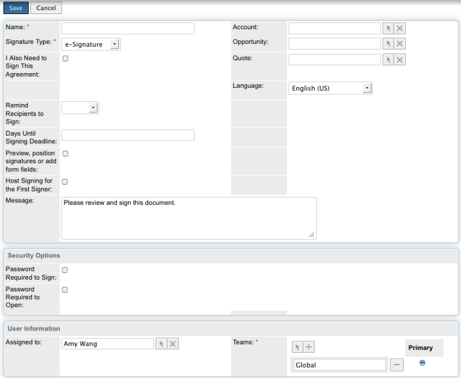

# [!DNL SugarCRM] Installatiegids {#sugarcrm-install-guide}

[Contact opnemen met de klantenservice](https://adobe.com/go/adobesign-support-center_nl)

Adobe [!DNL EchoSign] for [!DNL SugarCRM] is een toonaangevende oplossing voor e-handtekeningen en webcontracten die automatisering van elektronische handtekeningen biedt in [!DNL SugarCRM] voor e-handtekeningen en faxhandtekeningen. Gebruikers kunnen rechtstreeks contracten verzenden vanuit SugarCRM, de contractgeschiedenis bekijken en elektronisch ondertekende contracten opslaan met gekoppelde accounts, contactpersonen, offertes en meer.
Adobe [!DNL EchoSign] for [!DNL SugarCRM] is beschikbaar voor alle ondersteunde versies van SugarCRM, inclusief 6.3-6.7 voor on-demand of on-premise oplossingen.

Dit document is een richtlijn voor [!DNL SugarCRM] beheerders leren om Adobe te installeren en te configureren [!DNL EchoSign] for [!DNL SugarCRM] insteekmodule.

## Deze insteekmodule installeren {#install-plugin}

1. De Adobe ophalen [!DNL EchoSign] for [!DNL SugarCRM]  archivebestand uit het [SugarExchange-lijst](http://www.sugarexchange.com/product_details.php?product=1123).
1. Aanmelden [!DNL SugarCRM] met uw beheerdersaccount.
1. Ga naar **[!UICONTROL Beheer]** > **[!UICONTROL Module Loader]**.

   

1. Het archiefbestand van de Adobe uploaden [!DNL EchoSign] for [!DNL SugarCRM] insteekmodule, selecteren **[!UICONTROL Bladeren]** selecteert u vervolgens het archiefbestand en selecteert u **[!UICONTROL Uploaden]**.
1. Nadat het archiefbestand is geüpload, selecteert u **[!UICONTROL Installeren]** om de installatie te starten.
1. Bekijk de voorwaarden en bepalingen en selecteer vervolgens **[!UICONTROL Accepteren]** > **[!UICONTROL Vastleggen]**.
1. Als de insteekmodule is geïnstalleerd, geeft de voortgangsbalk aan dat de installatie 100% is gelukt.  Als de voortgangsbalk niet 100% bereikt, selecteert u **[!UICONTROL Logboek weergeven]** om de fout te zien die is aangetroffen door SugarCRM.

   

1. Ga na installatie naar **[!UICONTROL Beheer > Repareren]** en selecteer **[!UICONTROL Snel repareren en opnieuw samenstellen]**.

>[!NOTE]
>
>Als u de insteekmodule installeert op [!DNL SugarCRM] Op verzoek een ondersteuningsticket indienen met [!DNL SugarCRM] om tijdelijk de beperkingen van de pakketcontrole voor OnDemand te verwijderen, zodat het pakket kan worden geïnstalleerd. Dit maakt deel uit van het standaardproces.

## De insteekmodule upgraden {#upgrade-plugin}

Als u de Adobe bijwerkt [!DNL EchoSign] for [!DNL SugarCRM] in een nieuwere versie te installeren, moet u de plug-in installeren zonder de vorige versie te verwijderen.
Nadat u de insteekmodule hebt bijgewerkt, gaat u naar **[!UICONTROL Beheer]** > **[!UICONTROL Repareren]** en selecteer **[!UICONTROL Snel repareren en opnieuw samenstellen]**.

**Opmerking:** Als u een vorige plug-in verwijdert, mag u de tabellen niet verwijderen tijdens het verwijderen. Anders kunt u [!DNL EchoSign] overeenkomstgegevens.

## De insteekmodule configureren {#configure-plugin}

1. Als u al een Adobe bent [!DNL EchoSign] klant, ga verder met stap 2.

   Als u geen [!DNL EchoSign] account, [aanmelden voor een GRATIS proefversie van 14 dagen](https://sugarcrmintegration.echosign.com/public/login) en volg de online registratiestappen om uw Adobe in te schakelen [!DNL EchoSign] account.
1. Aanmelden bij [Echo Sign-account](http://www.echosign.com) en voer de volgende stappen uit:
   1. Selecteren **[!UICONTROL Account]** tabblad.
   1. Selecteren **[!UICONTROL EchoSign API]** linksonder.
   1. Selecteren **[!UICONTROL API-toegang inschakelen]** en haalt uw API-sleutel op van de pagina.

   

1. Ga in SugarCRM naar **[!UICONTROL Beheer]** > **[!UICONTROL Adobe EchoSign-instellingen]** en voert u de API-sleutel in in het veld met het label **[!UICONTROL EchoSign API-sleutel]**.
1. Configureer desgewenst de plug-in met de volgende instellingen:

   1. Automatisch PDF koppelen bij het maken van een overeenkomst vanuit een offerte: Selecteer of u automatisch een PDF van de offerte wilt bijvoegen als een [!DNL SugarCRM] een EchoSign-overeenkomst maakt vanuit de module Aanhalingstekens.
   1. Lijst met ontvangers beheren: Selecteer welke modules worden weergegeven in het subdeelvenster Ontvanger in het dialoogvenster [!DNL EchoSign] De module Overeenkomsten. Dit voegt ook de [!DNL EchoSign] Het subdeelvenster Overeenkomsten voor deze modules.
   1. Voeg de verzendknoppen toe aan deze modules: Selecteer deze optie als u het dialoogvenster [!DNL EchoSign] Overeenkomstknop/handeling die moet worden opgenomen in de primaire handelingen van de Offertemodule.
   1. Selecteren **[!UICONTROL Opslaan]** om uw instellingen op te slaan.

**Opmerking:** De Adobe [!DNL EchoSign] for [!DNL SugarCRM] insteekmodule vereist [PHP SOAP-extensie](http://www.php.net/manual/en/book.soap.php). Om SOAP-ondersteuning mogelijk te maken, configureert u PHP met enable-soap.

## Overeenkomstupdates ophalen (voor [!DNL SugarCRM] versies 6.3 of hoger) {#get-agreement-updates}

Voor versie 6.3 en hoger kunt u de volgende twee opties gebruiken om overeenkomsten te laten bijwerken. In eerdere versies van SugarCRM biedt de plug-in standaard alleen de callback-methode (optie 1).

### Optie 1: Stel de callback-methode in voor het pushen van updates naar EchoSign

Als uw website publiek is, kunt u ervoor zorgen dat Adobe EchoSign uw [!DNL SugarCRM] instantie wanneer een nieuwe gebeurtenis plaatsvindt. [!DNL SugarCRM] werkt vervolgens de overeenkomststatus, de gebeurtenissen bij en downloadt het ondertekende document (indien ondertekend) automatisch en in real-time. (Als u zich achter een firewall bevindt, moet u de [!DNL EchoSign] server-IP-adressen of gebruik de geplande taakmethode voor het bijwerken van EchoSign-overeenkomsten (beschreven in de volgende sectie van deze handleiding).

1. Ga naar **[!UICONTROL Beheer]** > **[!UICONTROL Adobe EchoSign-instellingen]**.
1. Schakel het selectievakje in **[!UICONTROL EchoSign-callbackmethode gebruiken]** om gebeurtenissen en statussen van overeenkomsten bij te werken.
1. Selecteren **[!UICONTROL Opslaan]**.

### Optie 2: Een geplande taak instellen voor [!DNL SugarCRM] Instanties achter een firewall

De [!DNL EchoSign] for [!DNL SugarCRM] plug-in kan ook een geplande taak gebruiken om query&#39;s uit te voeren [!DNL EchoSign] voor updates van overeenkomsten die verzonden zijn ter ondertekening. De geplande methode voor taakquery kan worden gebruikt als u een on-premise [!DNL SugarCRM] wordt geïnstalleerd achter een firewall.

Instellen:

1. Ga naar **[!UICONTROL Beheer]** > **[!UICONTROL Planner]**.
1. Selecteer in het vervolgkeuzemenu met tabbladen de optie **[!UICONTROL Planning maken]**.
1. Voer een taaknaam in.
1. Selecteer voor het veld Taak de optie **[!UICONTROL Adobe EchoSign Status Updater]**.
1. Stel de taak zo vaak als nodig in. Wij stellen voor om de overeenkomst elke 10 minuten te laten lopen, wat betekent dat een overeenkomst na het openen, lezen of ondertekenen maximaal 10 minuten kan duren [!DNL SugarCRM] die met die informatie moet worden bijgewerkt.

   **Opmerking:** Als u veel overeenkomsten ter ondertekening hebt verzonden, kan dit te vaak tot gevolg hebben dat uw systeem vertraagt.

   

1. Ga naar **[!UICONTROL Beheer]** > **[!UICONTROL Adobe EchoSign-instellingen]**.
1. Schakel het selectievakje uit **[!UICONTROL EchoSign-callbackmethode gebruiken]** om gebeurtenissen en statussen van overeenkomsten bij te werken.
1. Selecteren **[!UICONTROL Opslaan]**.
Opmerking: Schakel planningen in [!DNL SugarCRM] om dit te laten werken.

EchoSign-overeenkomsten toevoegen aan andere [!DNL SugarCRM] modules:

1. Ga naar **[!UICONTROL Beheer]** > **[!UICONTROL Studio]**.
1. Selecteer in de linkerkolommapstructuur de module voor het toevoegen van [!DNL EchoSign] Overeenkomsten.
1. Selecteren **[!UICONTROL Relaties]**> **[!UICONTROL Relaties toevoegen]**.
1. Selecteer in het vervolgkeuzemenu Tekst als **[!UICONTROL Eén naar vele]** en Module als **[!UICONTROL EchoSign-overeenkomsten]**.
1. Selecteren **[!UICONTROL Opslaan en implementeren]**.

   

   [!DNL EchoSign] Overeenkomsten worden nu in de module weergegeven en overeenkomsten kunnen daar worden gemaakt en bijgehouden.

   

**Andere configuratiestappen**

* **Verbergen [!DNL EchoSign] Modules**: U kunt de [!DNL EchoSign] Ontvangers en [!DNL EchoSign] De modules van gebeurtenissen door naar de Tabs van de Module van de Vertoning van het Beleid en Subpanels te gaan en hen naar de verborgen kolom te verplaatsen.
* **PackageScan uitschakelen**: Als u packageScan op uw eigen systeem hebt ingeschakeld, moet u het tijdens de installatie uitschakelen. Als u [!DNL SugarCRM] Op verzoek, contact [!DNL SugarCRM] ondersteuning om packageScan voor u uit te schakelen.

## De insteekmodule verwijderen {#uninstall-plugin}

1. Aanmelden [!DNL SugarCRM] met uw beheerdersaccount.
1. Ga naar **[!UICONTROL Beheer]** > **[!UICONTROL Module Loader]**.
1. Selecteren **[!UICONTROL Verwijderen]** naast de [!UICONTROL EchoSign voor SugarCRM-plug-in].
1. Selecteren **[!UICONTROL Vastleggen]** om te beginnen met verwijderen. U kunt ook selecteren om de databasetabellen te verwijderen die voor de plug-in zijn gemaakt.

   

   Als de insteekmodule is verwijderd, geeft de voortgangsbalk aan dat de installatie 100% is gelukt. Als de voortgangsbalk niet 100% bereikt, selecteert u [!UICONTROL Logboek weergeven] om de fout te zien die is aangetroffen door SugarCRM.

   

## Adobe gebruiken [!DNL EchoSign] for [!DNL SugarCRM] {#use-echosign-for-sugarcrm}

U kunt een Adobe maken [!DNL EchoSign] overeenkomst die is gekoppeld aan een account, contactpersoon, offerte of andere [!DNL SugarCRM] modules. U kunt bestanden bijvoegen, ontvangers opgeven en ter ondertekening verzenden. Adobe [!DNL EchoSign] updates [!DNL SugarCRM] met de huidige status van de overeenkomst en slaat het ondertekende contract op in [!DNL SugarCRM] zodra het volledig is uitgevoerd.

### Een Adobe maken en bewerken [!DNL EchoSign] overeenkomst {#create-edit-agreements}

U kunt overeenkomsten maken via de [!DNL EchoSign] De module van overeenkomsten of door modules die door een [!DNL SugarCRM] beheerder.

1. Van de [!UICONTROL Handelingen] lijst op de [!UICONTROL EchoSign-overeenkomsten] tab, selecteer **[!UICONTROL EchoSign-overeenkomst maken]**.
1. In het hoofdgedeelte van het dialoogvenster [!DNL EchoSign] Voer de volgende informatie in of selecteer een van de verschillende opties voor overeenkomsten:

   1. **[!UICONTROL Naam:]** Voer een naam in voor de overeenkomst.
   1. **[!UICONTROL Handtekeningtype:]** Selecteer het type handtekening dat is geaccepteerd voor het document. De opties zijn e-handtekening en Handtekening faxen.
   1. **[!UICONTROL Ik moet deze overeenkomst ook ondertekenen:]** Geef aan of de afzender de overeenkomst ook moet ondertekenen.
   1. **[!UICONTROL Handtekeningvolgorde:]** Als de vorige optie Ik moet deze overeenkomst ook ondertekenen is ingeschakeld, selecteert u ook de volgorde waarin de afzender en ontvangers moeten ondertekenen.
   1. **[!UICONTROL Ontvangers eraan herinneren te tekenen:]** Selecteer hoe vaak u een ontvanger eraan wilt herinneren om een document te ondertekenen. De opties zijn Dagelijks of Wekelijks.
   1. **[!UICONTROL Dagen tot ondertekeningsdeadline:]** Geef op hoeveel dagen de overeenkomst moet worden ondertekend.
   1. **[!UICONTROL Voorbeeld, positie handtekening of voeg formuliervelden toe:]**  Selecteer deze optie om een voorvertoning van de overeenkomst weer te geven voordat deze wordt verzonden of sleep handtekeningvelden, beginvelden of andere formuliervelden naar de overeenkomst voordat deze naar ontvangers wordt verzonden. Nadat u een voorvertoning van het document hebt weergegeven of de gewenste velden naar het document hebt gesleept, moet u de knop Verzenden selecteren om de overeenkomst naar de ontvanger te verzenden.
   1. **[!UICONTROL Host tekent voor de eerste ondertekenaar:]** Geef aan of de afzender de ondertekening van de overeenkomst persoonlijk wil hosten.
      * **[!UICONTROL Bericht:]** Neem een bericht op voor de ontvanger.
      * **[!UICONTROL Account, Opportunity, Offerte:]** Selecteer of wijzig de account, opportunity of offerte die aan deze overeenkomst is gekoppeld.
      * **[!UICONTROL Taal:]** Geef de taal op waarin de ondertekeningspagina en e-mailmeldingen aan de ontvangers worden weergegeven.

      

1. In het dialoogvenster [!UICONTROL Beveiligingsopties] van de [!UICONTROL EchoSign-overeenkomst]voert u de volgende informatie in:

   a) **[!UICONTROL Wachtwoord vereist om te ondertekenen:]** Geef aan of een wachtwoord moet worden ingevoerd voordat een ontvanger een document kan ondertekenen.
b) **[!UICONTROL Wachtwoord vereist om te openen:]** Geef aan of een wachtwoord moet worden ingevoerd voordat een ontvanger een PDF van de overeenkomst of ondertekende overeenkomst kan openen (c) **[!UICONTROL Wachtwoord:]** Geef het wachtwoord op waarmee u een document wilt ondertekenen of openen.
d) **[!UICONTROL Wachtwoord bevestigen:]** Bevestig het wachtwoord voor het ondertekenen of openen van een document.

1. In de andere sectie van het [!DNL EchoSign] Voer de volgende gegevens in:

   a) **[!UICONTROL Gebruiker:]** Geef een [!DNL SugarCRM] gebruiker. De standaardinstelling is de gebruiker die momenteel is aangemeld bij het systeem.
b) **[!UICONTROL Teams:]** Als u de primaire teamtoewijzing wilt wijzigen, voert u de naam van het nieuwe primaire team in. Als u meer teams aan de record wilt toewijzen, klikt u op **[!UICONTROL Selecteren]** en selecteer een team van de Lijst van het Team, of selecteer **[!UICONTROL Toevoegen aan]** om teamvelden toe te voegen en de teamnamen in te voeren. Zie &#39;Records toewijzen aan gebruikers en teams&#39; in de [!DNL SugarCRM] Toepassingsgids.

1. Selecteren **[!UICONTROL Opslaan]**.

### [!DNL EchoSign] weergave van overeenkomstdetails {#agreement-detail-view}

Na een [!DNL EchoSign] Overeenkomst wordt opgeslagen. De detailweergave van de overeenkomst bevat de volgende subdeelvensters:

* **[!UICONTROL Ontvangers:]** Alle contactpersonen in dit subdeelvenster ontvangen de documenten die zijn opgegeven in het subdeelvenster Documenten. U moet een of meer ontvangers toevoegen voordat u de overeenkomst verzendt.
* **[!UICONTROL Documenten:]** Een nieuw document uploaden of een document selecteren dat al is geüpload naar [!DNL SugarCRM] om ter ondertekening te verzenden.
* **[!UICONTROL Gebeurtenissen:]** Alle handelingen met betrekking tot de overeenkomst, zoals wanneer de overeenkomst ter ondertekening is verzonden, bekeken of ondertekend, worden in dit subdeelvenster weergegeven.
Een [!DNL EchoSign] Overeenkomst, selecteer de [!UICONTROL Bewerken] op de knop [!UICONTROL Gedetailleerde weergave] van de overeenkomst.

**Opmerking:** Nadat een overeenkomst ter ondertekening is verzonden, [!UICONTROL Bewerken] wordt verwijderd uit de detailweergave om de record van gebeurtenissen te behouden. U kunt echter wel de knop Bewerken inschakelen. Ga hiervoor naar [!UICONTROL Beheerder] > [!UICONTROL Adobe EchoSign-instellingen] en schakel de optie uit *[!UICONTROL Nadat een overeenkomst ter ondertekening is verzonden, schakelt u de mogelijkheid uit om de overeenkomst te bewerken of te verwijderen]*.

### Een document toevoegen aan een [!DNL EchoSign] overeenkomst {#add-document}

[!DNL SugarCRM] gebruikers kunnen een nieuw document uploaden of een document selecteren dat al is geüpload naar [!DNL SugarCRM] door het subdeelvenster Documenten van een EchoSign-overeenkomstrecord te gebruiken.
Als u een document wilt uploaden, selecteert u **[!UICONTROL Document uploaden]** in de [!UICONTROL Documenten] subdeelvenster.

Zie de sectie &#39;Documentmodule&#39; van het [!DNL SugarCRM] Toepassingshandleiding voor meer informatie over de afzonderlijke velden van het formulier.

Als u een document wilt selecteren, klikt u op **[!UICONTROL Selecteren]** in het subdeelvenster Documenten. Zie ‘Recordinformatie bekijken en beheren’ in het [!DNL SugarCRM] De Gids van de toepassing voor meer informatie over hoe te om verwante informatie in subpanels te beheren.

### Een ontvanger opgeven voor een [!DNL EchoSign] overeenkomst {#specify-recipient}

1. Van de [!UICONTROL Ontvanger] subdeelvenster van een [!DNL EchoSign] Overeenkomst, selecteer **[!UICONTROL Ontvanger toevoegen]**.
1. Voer de volgende gegevens in: a) [!UICONTROL Ontvanger:] Selecteer het type ontvanger in de vervolgkeuzelijst. Typ de naam of het e-mailadres van de ontvanger in het tekstveld. [!DNL SugarCRM] zoekt de naam op terwijl u typt en biedt een lijst met selecties aan. Selecteer een naam als er een overeenkomst is gevonden. U kunt ook het pijlpictogram selecteren om een naam te selecteren in een pop-upvenster. Als u de naam uit het veld wilt wissen, selecteert u de optie **[!UICONTROL X]** pictogram.
b) [!UICONTROL Rol:] Selecteer een rol in het vervolgkeuzemenu. De opties zijn Ondertekenaar en CC en Fiatteur. Een fiatteur hoeft het document niet te ondertekenen.
1. Selecteer Opslaan.

### Overeenkomsten verzenden ter ondertekening {#send-for-signature}

Als overeenkomsten klaar zijn om te worden verzonden voor ondertekening, selecteert u **[!UICONTROL Send for Signature]** in het vervolgkeuzemenu linksboven op de pagina. De ontvangers ontvangen vervolgens een e-mail waarin ze op de hoogte worden gesteld van de documenten die op hun handtekening wachten. Nadat de ontvangers het document hebben ondertekend, ontvangt de afzender een e-mailmelding.
Als de [!UICONTROL Host tekent voor eerste ondertekenaar] is ingeschakeld, kunt u **[!UICONTROL Send for Signature]** om de ondertekenaar in staat te stellen het document te ondertekenen met de aanwezige afzender.

A **[!UICONTROL Host tekent voor huidige ondertekenaar]** de koppeling verschijnt ook naast de [!UICONTROL Host tekent voor eerste ondertekenaar] veld, dat kan worden geopend totdat het document is ondertekend. U kunt deze koppeling gebruiken om de ondertekening van overeenkomsten voor meerdere ondertekenaars te hosten of om het pop-upvenster opnieuw te openen als het per ongeluk is gesloten.
Als [!UICONTROL Voorvertoning, positie handtekening of formuliervelden toevoegen] is ingeschakeld, selecteert u **[!UICONTROL Send for Signature]** om de afzender de mogelijkheid te geven een voorvertoning van het document weer te geven of om velden naar het document te slepen voordat het wordt verzonden. U moet **[!UICONTROL Verzenden]** in dat venster om de overeenkomst naar de ontvanger te verzenden.

Figuur 5: Selecteer Send for Signature om een document ter ondertekening naar een ontvanger te verzenden.

### Verzenden vanuit een offerterecord {#send-from-quote-record}

Adobe [!DNL EchoSign] heeft een directe integratie met offertes in [!DNL SugarCRM] zodat de PDF van de offerte automatisch wordt gegenereerd en als bijlage aan de overeenkomstrecord wordt toegevoegd.
Selecteer **[!UICONTROL EchoSign-overeenkomst maken]** om de offerte te genereren en deze automatisch aan de overeenkomst te koppelen. In de nieuwe overeenkomst worden ook automatisch verwante opportunity&#39;s, accounts of offertes gekoppeld.

Als u de automatische bijlage van de PDF van de offerte bij de overeenkomst wilt uitschakelen, gaat u naar **[!UICONTROL Beheer]** > **[!UICONTROL Adobe EchoSign-instellingen]** en schakel het selectievakje uit *[!UICONTROL PDF automatisch koppelen bij het maken van een overeenkomst vanuit een offerte]*.

### Een overeenkomst annuleren {#cancel-agreement}

U kunt een [!DNL EchoSign] Overeenkomst nadat deze ter ondertekening is verzonden als alle ontvangers het document nog niet hebben ondertekend. A [!UICONTROL Overeenkomst annuleren] verschijnt in de detailweergave van een overeenkomst nadat een document ter ondertekening is verzonden. Selecteren **[!UICONTROL Overeenkomst annuleren]** om de overeenkomst te annuleren.

Opmerking: Als een [!DNL EchoSign] Overeenkomst wordt verzonden ter ondertekening en de record wordt verwijderd. U moet de overeenkomst annuleren voordat u deze verwijdert.

### Handtekeningen bijhouden {#track-signatures}

De [!UICONTROL Gebeurtenissen] subdeelvenster van een [!DNL EchoSign] Overeenkomst houdt de status bij van overeenkomsten die ter ondertekening worden verzonden. Als u de meest recente updates wilt zien, kunt u het volgende doen: [!DNL EchoSign] Overeenkomst, selecteer **[!UICONTROL Status bijwerken]**. De [!UICONTROL Status bijwerken] is alleen beschikbaar nadat een overeenkomst ter ondertekening is verzonden.

Nadat een overeenkomst ter ondertekening is verzonden, selecteert u **[!UICONTROL Status bijwerken]** om de laatste status op te halen.

### Herinneringen verzenden {#send-reminders}

Selecteer **[!UICONTROL Herinnering verzenden]**. Het verzendt onmiddellijk een e-mailherinnering naar de huidige ondertekenaar over de overeenkomst die op ondertekening wacht.

