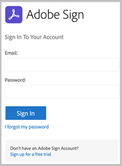

# [!DNL Veeva Vault] Installatiegids{#veeva-installation-guide}

[**Contact opnemen met de ondersteuning van Adobe Sign**](https://adobe.com/go/adobesign-support-center_nl)

## Overzicht {#overview}

In dit document wordt uitgelegd hoe u Adobe Sign kunt integreren met [!DNL Veeva Vault] platform. [!DNL Veeva Vault] is een ECM-platform (Enterprise Content Management) dat is ontwikkeld voor biowetenschappen. Een &quot;Vault&quot; is een content- en dataopslagplaats met een typisch gebruik voor archivering van regelgeving, rapportering over onderzoek, subsidieaanvragen, algemene contracten en meer. Een enkele onderneming kan meerdere &#39;waarden&#39; hebben die afzonderlijk moeten worden onderhouden.

De stappen op hoog niveau om de integratie te voltooien zijn:

* Activeer uw beheeraccount in Adobe Sign (alleen voor nieuwe klanten)
* Maak objecten om de geschiedenis van een levenscyclus van een overeenkomst in de Vault bij te houden.
* Maak een nieuw beveiligingsprofiel.
* Configureer een groep in Adobe Sign die de [!DNL Veeva Vault] integratiegebruiker.
* Maak documentvelden en uitvoeringen.
* Webacties configureren en de levenscyclus van het document bijwerken.
* Documenttype instellen voor gebruiker en gebruikersrol.

>[!NOTE]
>
>Adobe Sign-beheerder moet de Adobe Sign-installatiestappen uitvoeren in Adobe Sign.

## Configureer [!DNL Veeva Vault]

Om te configureren [!DNL Veeva Vault] voor integratie met Adobe Sign, maakt u bepaalde objecten waarmee u de geschiedenis van een levenscyclus van een overeenkomst in Vault kunt volgen. Beheerders moeten de volgende objecten maken:

* Handtekening
* Handtekening
* Handtekeninggebeurtenis
* Procesfunctie

### Handtekeningobject maken  {#create-signature-object}

Handtekeningobject wordt gemaakt voor het opslaan van informatie over overeenkomsten. Een handtekeningobject is een database die informatie bevat in de volgende specifieke velden:

**Handtekeningobjectvelden**

| Veld  | Label | Type | Beschrijving |
| --- | --- | ---| --- | 
| external_id_c | Overeenkomst-id | Tekenreeks (100) | Houdt de unieke overeenkomst-id van de Adobe Sign vast |
| file_hash__c | Bestandshash | Tekenreeks (50) | Bevat de md5-controlesom van het bestand dat naar Adobe Sign is verzonden |
| name_v | Naam | String (128) | Bevat de overeenkomstnaam |
| sender_c | Afzender | Object (gebruiker) | Bevat de verwijzing naar de Vault-gebruiker die de overeenkomst heeft gemaakt |
| signature_status__c | Handtekeningstatus | Tekenreeks (75) | Houdt de status van de overeenkomst vast in Adobe Sign |
| signature_type__c | Handtekeningtype | Tekenreeks (20) | Houdt het handtekeningtype van de overeenkomst vast in Adobe Sign (SCHRIFTELIJK of ESIGN) |
| start_date__c | Startdatum | DateTime | Datum waarop de overeenkomst ter ondertekening is verzonden |
| cancelation_date__c | Annuleringsdatum | DateTime | Houdt de datum vast waarop de overeenkomst is geannuleerd. |
| completion_date__c | Voltooiingsdatum | DateTime | Houdt de datum vast waarop de overeenkomst is voltooid. |
| viewable_rendition_used__c | Gebruikte zichtbare vertoning | Booleaanse waarde | Markering die aangeeft of de zichtbare vertoning ter ondertekening is verzonden. (standaard is dit waar) |

### Handtekeningenobject maken {#create-signatory-object}

Handtekeningobject wordt gemaakt om informatie op te slaan die betrekking heeft op de deelnemers aan een overeenkomst. Het bevat informatie onder de volgende specifieke gebieden:

**Handtekeningobjectvelden**

| Veld  | Label | Type | Beschrijving |
| --- | --- | ---| --- | 
| email_c | E-mail | Tekenreeks (120) | Houdt de unieke overeenkomst-id van de Adobe Sign vast |
| external_id_c | Deelnemer-id | Tekenreeks (80) | Houdt de unieke id van de Adobe Sign-deelnemer |
| name_v | Naam | String (128) | Houdt de naam van een Adobe Sign-deelnemer vast |
| order__c | Volgorde | Getal | Houdt het ordernummer van de Adobe Sign-overeenkomstdeelnemer |
| role_c | Rol | Tekenreeks (30) | Houdt de rol van de deelnemer aan de Adobe Sign-overeenkomst vast |
| signature__c | Handtekening | Object (handtekening) | Bevat de verwijzing naar de bovenliggende handtekeningrecord |
| signature_status__c | Handtekeningstatus | Tekenreeks (100) | Houdt de status van de deelnemer aan de Adobe Sign-overeenkomst |
| user_c | Gebruiker | Object (gebruiker) | Bevat de verwijzing naar de gebruikersrecord van de ondertekenaar als deelnemer een Vault-gebruiker is |

### Handtekeninggebeurtenisobject maken  {#create-signature-event}

Handtekeninggebeurtenisobject wordt gemaakt om gebeurtenisgerelateerde informatie van een overeenkomst op te slaan. Het bevat informatie onder de volgende specifieke gebieden:

| Veld  | Label | Type | Beschrijving |
| --- | --- | ---| --- | 
| acting_user_email_c | E-mail waarnemend gebruiker | Tekenreeks | Bevat het e-mailadres van de Adobe Sign-gebruiker die de handeling heeft uitgevoerd die ertoe heeft geleid dat de gebeurtenis is gegenereerd |
| acting_user_name__c | Handelsnaam | Tekenreeks | Houdt de naam vast van de Adobe Sign-gebruiker die de handeling heeft uitgevoerd die ertoe heeft geleid dat de gebeurtenis is gegenereerd |
| description_c | Beschrijving | Tekenreeks | Bevat de beschrijving van de Adobe Sign-gebeurtenis |
| event_date__c | Gebeurtenisdatum | DateTime | Houdt de datum en tijd van de Adobe Sign-gebeurtenis vast |
| event_type__c | Het type Event | Tekenreeks | Houdt het type Adobe Sign-gebeurtenis vast |
| name_v | Naam | Tekenreeks | Automatisch gegenereerde gebeurtenisnaam |
| participant_comment_c | Opmerking deelnemer | Tekenreeks | Bevat de eventuele opmerking van de Adobe Sign-deelnemer |
| participant_email_c | E-mail deelnemer | Tekenreeks | Bevat het e-mailadres van de Adobe Sign-deelnemer |
| participant_role__c | Rol van deelnemer | Tekenreeks | Houdt de rol van de Adobe Sign-deelnemer vast |
| signature__c | Handtekening | Object (handtekening) | Bevat de verwijzing naar de bovenliggende handtekeningrecord |

### Proces-Locker-object maken  {#create-process-locker}

Er wordt een Process Locker-object gemaakt om het Adobe Sign-integratieproces te vergrendelen. Er zijn geen aangepaste velden voor nodig.

## Beveiligingsprofielen maken{#security-profiles}

Voor een succesvolle integratie van de vault wordt een nieuw beveiligingsprofiel *Adobe Sign-integratieprofiel* wordt gemaakt en is ingesteld op *Adobe Sign-beheeracties*. Het Adobe Sign Integration Profile wordt toegewezen aan het systeemaccount en wordt door de integratie gebruikt bij het aanroepen van Vault API&#39;s. Dit profiel staat machtigingen toe voor:

* Vault-API&#39;s
* Lezen, maken, bewerken en verwijderen: Handtekening, handtekening, handtekeninggebeurtenissen en procesklubjecten

Voor beveiligingsprofielen van gebruikers die toegang tot de geschiedenis van Adobe Sign in de Vault nodig hebben, moeten leesmachtigingen gelden voor de objecten Handtekening, Handtekening en Handtekeninggebeurtenis.

## Groep maken {#create-group}

Adobe Sign configureren voor [!DNL Vault], een nieuwe groep genaamd *Adobe Sign Admin Group* wordt gemaakt. Deze groep wordt gebruikt om de beveiliging op documentveldniveau in te stellen voor Adobe Sign-gerelateerde velden en moet *Adobe Sign-integratieprofiel* standaard.

## Gebruiker aanmaken {#create-user}

De gebruiker van de Vault-systeemaccount voor Adobe Sign-integratie moet:

* Adobe Sign-integratieprofiel hebben
* Een beveiligingsprofiel hebben
* Heb Specifiek veiligheidsbeleid dat wachtwoordafloop onbruikbaar maakt
* Word lid van de Adobe Sign Admin Group.

Als u er zeker van wilt zijn dat de gebruiker van de systeemaccount behoort tot de Adobe Sign Admin Group voor de specifieke levenscyclus van het document, moet u records voor de gebruikersrolinstelling maken.

## Toepassingsrollen maken {#create-application-roles}

U moet de toepassingsrol creëren geroepen *Adobe Sign-beheerdersrol*. Deze rol moet worden gedefinieerd in de levenscyclus van elk documenttype dat in aanmerking komt voor Adobe-ondertekening. Voor elke specifieke levenscyclusstatus van Adobe Sign wordt de Adobe Sign Admin Role toegevoegd en geconfigureerd met de juiste machtigingen.

## Documentvelden maken {#create-fields}

Beheerders moeten de volgende twee nieuwe gedeelde documentvelden maken om integratie met Adobe Sign tot stand te brengen:

* Handtekening (handtekening__c)
* Adobe Sign-gebruikersacties toestaan (allow_adobe_sign_user_actions__c)

Deze gedeelde velden moeten worden toegevoegd aan alle documenttypen die in aanmerking komen voor Adobe-ondertekening. Beide velden moeten een specifieke beveiliging hebben waarmee alleen leden van de Adobe Sign Admin Group hun waarden kunnen bijwerken.

Beheerders moeten het bestaande gedeelde veld toevoegen *Vault-overlays uitschakelen (disable_vault_overlays__v)* en stel deze in op Actief voor alle documenttypen die in aanmerking komen voor Adobe-ondertekening. Optioneel kan het veld een specifieke beveiliging hebben waarmee alleen leden van de Adobe Sign-beheerdersgroep hun waarde kunnen bijwerken.

## Documentuitvoeringen maken {#create-renditions}

Beheerders moeten een nieuw weergavetype maken met de naam *Adobe Sign Rendition (adobe_sign_rendition__c)*, die wordt gebruikt door Vault-integratie voor het uploaden van ondertekende PDF-documenten naar Adobe Sign. De Adobe Sign-uitvoering moet worden gedeclareerd voor elk documenttype dat in aanmerking komt voor Adobe-ondertekening.

## Webacties configureren {#web-actions}

Voor Adobe Sign- en Vault-integratie hebt u de volgende twee webhandelingen nodig:

* **Adobe Sign maken**: Er wordt een Adobe Sign-overeenkomst gemaakt of weergegeven.

   Type: Documentdoel: Weergeven binnen vault-URL: <https://{integrationDomain}/veevavaultintsvc/partner/agreement?docId=${Document.id}&majVer=${Document.major_version_number__v}&minVer=${Document.minor_version_number__v}&vaultId=${Vault.Id>}

* **Adobe Sign annuleren**: Hiermee wordt een bestaande overeenkomst in Adobe Sign geannuleerd en wordt de oorspronkelijke documentstatus hersteld.

   Type: Documentdoel: Weergeven binnen vault-URL: <https://{integrationDomain}/veevavaultintsvc/partner/agreement/cancel?docId=${Document.id}&majVer=${Document.major_version_number__v}&minVer=${Document.minor_version_number__v}&vaultId=${Vault.Id>}

## Documentlevenscyclus bijwerken {#document-lifecycle}

Voor elk documenttype dat in aanmerking komt voor de Adobe-handtekening, moet de bijbehorende levenscyclus van het document worden bijgewerkt door nieuwe levenscyclusrol en -statussen toe te voegen.

### Levenscyclusrol {#lifecycle-role}

De Adobe Sign-beheerdersrol moet worden toegevoegd aan alle levenscycli die worden gebruikt door documenten die in aanmerking komen voor Adobe-ondertekening. Deze rol moet met de volgende opties worden gemaakt:

* Dynamisch toegangsbeheer inschakelen
* Regels voor het delen van documenten die alleen Document Type Group bevatten

### Levenscyclusstatussen {#lifecycle-states}

De levenscyclus van Adobe Sign-overeenkomsten heeft de volgende statussen:

* CONCEPT
* AUTHORING OF DOCUMENTS_NOT_YET_PROCESSED
* OUT_FOR_SIGNATURE of OUT_FOR_APPROVAL
* ONDERTEKEND OF GOEDGEKEURD
* GEANNULEERD
* VERLOPEN

Wanneer een Vault-document naar Adobe Sign wordt verzonden, moet de status overeenkomen met de status van de overeenkomst. Hiervoor voegt u de volgende statussen toe in elke levenscyclus die wordt gebruikt door documenten die in aanmerking komen voor Adobe-ondertekening:

* **Voor Adobe-handtekening** (Gereviseerd): Dit is een plaatsaanduidingsnaam voor het frame van waaruit het document naar Adobe Sign kan worden verzonden. Afhankelijk van het documenttype kan de status Concept of Gecontroleerd zijn. Het label van de documentstatus kan worden aangepast aan de vereisten van de klant. Voordat de handtekeningstatus Adobe wordt ingesteld, moeten de volgende twee gebruikersacties worden gedefinieerd:

   * Actie waarmee de status van het document wordt gewijzigd in *In Adobe Sign Draft* status. De naam van deze gebruikersactie moet voor alle documenttypes voor om het even welke levenscyclus gelijk zijn. Indien nodig kunnen de criteria voor deze actie worden ingesteld op &quot;Adobe Sign-gebruikersacties toestaan is gelijk aan Ja&quot;.
   * Actie die de webactie &quot;Adobe Sign&quot; noemt. Deze status moet zijn beveiligd zodat Adobe Sign Admin Role: document weergeven, inhoud weergeven, velden bewerken, relaties bewerken, bron downloaden, zichtbare uitvoering beheren en status wijzigen.

   

* **In Adobe Sign Draft**: Dit is een plaatsaanduidingsnaam voor de status die aangeeft dat het document al is geüpload naar Adobe Sign en dat de overeenkomst de status DRAFT. Het is een vereiste staat. Deze status moet de volgende vijf gebruikersacties definiëren:

   * Actie waarmee de status van het document wordt gewijzigd in *In Adobe Sign Authoring* status. De naam van deze gebruikersactie moet voor alle documenttypes voor om het even welke levenscyclus gelijk zijn. Indien nodig kunnen de criteria voor deze actie worden ingesteld op &quot;Adobe Sign-gebruikersacties toestaan is gelijk aan Ja&quot;.
   * Actie waarmee de status van het document wordt gewijzigd in *In ondertekeningsstatus Adobe*. De naam van deze gebruikersactie moet voor alle documenttypes voor om het even welke levenscyclus gelijk zijn. Indien nodig kunnen de criteria voor deze actie worden ingesteld op &quot;Adobe Sign-gebruikersacties toestaan is gelijk aan Ja&quot;.
   * Actie waarmee de status van het document wordt gewijzigd in *Adobe Sign geannuleerd* status. De naam van deze gebruikersactie moet voor alle documenttypes voor om het even welke levenscyclus gelijk zijn. Indien nodig kunnen de criteria voor deze actie worden ingesteld op &quot;Adobe Sign-gebruikersacties toestaan is gelijk aan Ja&quot;.
   * Handeling die de webactie &quot;Adobe Sign&quot; noemt.
   * Handeling die de webhandeling ‘Adobe Sign annuleren’ aanroept. Deze status moet zijn beveiligd zodat de Adobe Sign-beheerdersrol het volgende kan doen: document weergeven, inhoud weergeven, velden bewerken, relaties bewerken, bron downloaden, zichtbare uitvoering beheren en status wijzigen.

   

* **In Adobe Sign Authoring**: Dit is een tijdelijke aanduiding voor de status die aangeeft dat het document al is geüpload naar Adobe Sign en dat de overeenkomst de status AUTHORING of DOCUMENTS_NOT_YET_PROCESSED heeft. Het is een vereiste staat. Voor deze status moeten vier gebruikersacties worden gedefinieerd:

   * Handeling die de status van het document wijzigt in Adobe Sign Canceled state. De naam van deze gebruikersactie moet voor alle documenttypen gelijk zijn, ongeacht de levenscyclus. Indien nodig kunnen de criteria voor deze actie worden ingesteld op &quot;Adobe Sign-gebruikersacties toestaan is gelijk aan Ja&quot;.
   * Handeling waarmee de status van het document wordt gewijzigd in In Adobe Signing-status. De naam van deze gebruikersactie moet voor alle documenttypen gelijk zijn, ongeacht de levenscyclus. Indien nodig kunnen de criteria voor deze actie worden ingesteld op &quot;Adobe Sign-gebruikersacties toestaan is gelijk aan Ja&quot;.
   * Handeling die de webactie &quot;Adobe Sign&quot; noemt
   * Handeling die de webhandeling ‘Adobe Sign annuleren’ aanroept. Deze status moet zijn beveiligd zodat de Adobe Sign-beheerdersrol het volgende kan doen: document weergeven, inhoud weergeven, velden bewerken, relaties bewerken, bron downloaden, zichtbare uitvoering beheren en status wijzigen.

   

* **In Adobe-ondertekening**: Dit is een plaatsaanduidingsnaam voor de status die aangeeft dat het document is geüpload naar Adobe Sign en dat de overeenkomst al is verzonden naar deelnemers (status OUT_FOR_SIGNATURE of OUT_FOR_APPROVAL). Het is een vereiste staat. Voor deze status moeten vijf gebruikersacties worden gedefinieerd:

   * Handeling die de status van het document wijzigt in Adobe Sign Canceled state. De doelstatus van deze actie kan elke klantbehoefte zijn en kan voor verschillende typen verschillen. De naam van deze gebruikersactie moet voor alle documenttypen gelijk zijn, ongeacht de levenscyclus. Indien nodig kunnen de criteria voor deze actie worden ingesteld op &quot;Adobe Sign-gebruikersacties toestaan is gelijk aan Ja&quot;.
   * Handeling die de status van het document wijzigt in Adobe Sign Afgewezen status. De doelstatus van deze actie kan elke klantbehoefte zijn en kan voor verschillende typen verschillen. De naam van deze gebruikersactie moet voor alle documenttypen gelijk zijn, ongeacht de levenscyclus. Indien nodig kunnen de criteria voor deze actie worden ingesteld op &quot;Adobe Sign-gebruikersacties toestaan is gelijk aan Ja&quot;.
   * Handeling waarmee de status van het document wordt gewijzigd in Adobe Signed state. De doelstatus van deze actie kan elke klantbehoefte zijn en kan voor verschillende typen verschillen. De naam van deze gebruikersactie moet echter gelijk zijn voor alle documenttypen, ongeacht de levenscyclus. Indien nodig kunnen de criteria voor deze actie worden ingesteld op &quot;Adobe Sign-gebruikersacties toestaan is gelijk aan Ja&quot;.
   * Handeling die de webhandeling aanroept *Adobe Sign*.
   * Handeling die een webhandeling aanroept *Adobe Sign annuleren*. Deze status moet zijn beveiligd zodat de Adobe Sign-beheerdersrol het volgende kan doen: document weergeven, inhoud weergeven, velden bewerken, relaties bewerken, bron downloaden, zichtbare uitvoering beheren en status wijzigen.

   

* **Adobe ondertekend (goedgekeurd)**: Dit is een tijdelijke aanduiding voor de status die aangeeft dat het document is geüpload naar Adobe Sign en dat de overeenkomst is voltooid (ONDERTEKEND of GOEDGEKEURD). Het is een vereiste status en het kan een bestaande levenscyclusstatus zijn, zoals Goedgekeurd.
Voor deze status zijn geen handelingen van de gebruiker vereist. Deze status moet zijn beveiligd zodat de Adobe Sign-beheerdersrol: bekijk documenten, bekijk inhoud en bewerk velden.

In het volgende diagram worden de toewijzingen weergegeven tussen Adobe Sign-overeenkomsten en vault-documentstatussen, waarbij de status ‘Voor Adobe-ondertekening’ Concept is.

## Documenttypegroep maken en Rolinstellingen gebruiker maken  {#document-type-group-user-role}

### Groep documenttype maken {#create-document-type-group}

Beheerders moeten een nieuwe Document Type Group-record maken met de naam &quot;Adobe Sign Document&quot;. Deze documenttypegroep wordt toegevoegd voor alle documentclassificaties die in aanmerking komen voor het Adobe Sign-proces. Aangezien de documenttype groepseigenschap niet van het type naar het subtype of van het subtype naar het classificatieniveau wordt overgeërfd, moet deze worden ingesteld voor de indeling van elk document die in aanmerking komt voor Adobe Sign.

### Gebruikersrolinstelling maken {#create-user-role-setup}

Als de levenscyclus correct is (zijn) geconfigureerd, moet het systeem ervoor zorgen dat de Adobe Sign Admin-gebruiker door DAC wordt toegevoegd voor alle documenten die in aanmerking komen voor Adobe Sign-proces. Dit wordt gedaan door het aangewezen verslag van de Opstelling van de Rol van de Gebruiker te creëren dat specificeert:

* Document Type Group als &#39;Adobe Sign Document&#39;,
* Toepassingsrol als &#39;Adobe Sign-beheerdersrol&#39; en
* Integratiegebruiker.

>[!NOTE]
>
>Als het instellingsobject voor gebruikersrollen niet het veld bevat dat verwijst naar het object Groep documenttype, moet dit veld worden toegevoegd.

## Verbinden [!DNL Veeva Vault] naar Adobe Sign met behulp van middleware {#connect-middleware}

Nadat u de installatie voor [!DNL Veeva Vault] en de Adobe Sign-beheerdersaccount moet de beheerder een verbinding tussen de twee accounts maken met behulp van de middleware. De [!DNL Veeva Vault] en Adobe Sign-accountverbinding wordt geïnitieerd door Adobe Sign Identity en wordt vervolgens gebruikt om de Veva Vault-identiteit op te slaan.
Voor systeembeveiliging en -stabiliteit moet de beheerder een toegewijde [!DNL Veeva Vault] systeem-/service-/utiliteitsaccount, zoals `adobe.for.veeva@xyz.com`in plaats van een persoonlijke gebruikersaccount, zoals `bob.smith@xyz.com`.

Een Adobe Sign-accountbeheerder moet de onderstaande stappen volgen om verbinding te maken [!DNL Veeva Vault] naar Adobe Sign met middleware:

1. Ga naar de [Adobe Sign for [!DNL Veeva Vault] Startpagina](https://static.adobesigncdn.com/veevavaultintsvc/index.html).
1. Selecteren **[!UICONTROL Aanmelden]** in de rechterbovenhoek.

   

1. Geef op de Adobe Sign-aanmeldingspagina die wordt geopend de e-mail en het wachtwoord van de accountbeheerder op en selecteer **[!UICONTROL Aanmelden]**.

   

   Nadat u zich hebt aangemeld, wordt op de pagina de bijbehorende e-mail-ID en het tabblad Instellingen weergegeven, zoals hieronder wordt weergegeven.

   

1. Selecteer de **[!UICONTROL Instellingen]** tabblad.

   Op de pagina Instellingen worden de beschikbare verbindingen weergegeven. In het geval van de eerste verbindingsinstellingen wordt geen verbinding weergegeven, zoals hieronder wordt weergegeven.

   

1. Selecteren **[!UICONTROL Verbinding toevoegen]** om een nieuwe verbinding toe te voegen.

1. Geef in het dialoogvenster Verbinding toevoegen dat nu wordt geopend, de vereiste gegevens op, zoals [!DNL Veeva Vault] referenties.

   De Adobe Sign-referenties worden automatisch ingevuld vanaf de eerste Adobe Sign-aanmelding.

   

1. Selecteren **[!UICONTROL Valideren]** om de accountgegevens te valideren.

   Bij succesvolle validatie ziet u een melding &#39;Met succes gevalideerd door gebruiker&#39;, zoals hieronder weergegeven.

   

1. Als u het gebruik wilt beperken tot een bepaalde Adobe Sign-groep, vouwt u de **[!UICONTROL Groep]** en selecteer een van de beschikbare groepen.

   

1. Selecteren **[!UICONTROL Opslaan]** om uw nieuwe verbinding op te slaan.

   De nieuwe verbinding wordt weergegeven op het tabblad Instellingen, waarin de integratie tussen [!DNL Veeva Vault] en Adobe Sign.

   

## Levenscyclus pakketimplementatie {#deployment-lifecycle}

### Algemene levenscyclus van implementatie {#general-deployment}

**Stap 1.** Maak een nieuwe toepassingsrol met de naam &#39;Adobe Sign-beheerdersrol&#39;.

**Stap 2.** Maak een nieuwe groep documenttypen met de naam &#39;Adobe Sign-document&#39;.

**Stap 3.** Implementeer het pakket.

**Stap 4.** Maak een nieuwe door de gebruiker beheerde groep met de naam &#39;Adobe Sign Admin Group&#39;.

**Stap 5.** Maak een integratiegebruikersprofiel met het beveiligingsprofiel &quot;Adobe Sign Integration Profile&quot; en wijs dit toe aan de Adobe Sign Admin Group.

**Stap 6.** Wijs reader-machtigingen voor alle beveiligingsprofielen toe aan de objecten Handtekening, Handtekening en Handtekeninggebeurtenis voor gebruikers die toegang tot de geschiedenis van Adobe Sign in Vault nodig hebben.

**Stap 7.** Definieer de Adobe Sign-beheerdersrol in de levenscyclus van elk documenttype dat in aanmerking komt voor Adobe-ondertekening. Voor elke Adobe Sign-specifieke levenscyclusstatus wordt deze rol toegevoegd en geconfigureerd met de juiste machtigingen.

**Stap 8.** Declareer Adobe Sign-vertoning voor elk documenttype dat in aanmerking komt voor Adobe-ondertekening.

**Stap 9.** Voor elk documenttype dat in aanmerking komt voor Adobe-handtekening, werkt u de bijbehorende levenscyclus van het document bij door de nieuwe levenscyclusrol en -statussen toe te voegen.

**Stap 10.** Voeg de documenttypegroep &#39;Adobe Sign-document&#39; toe voor alle documentclassificaties die in aanmerking komen voor Adobe Sign-proces.

**Stap 11.** Nadat alle configuraties zijn voltooid, zorgt het systeem ervoor dat de Adobe Sign Admin-gebruiker door DAC wordt toegevoegd voor alle documenten die in aanmerking komen voor Adobe Sign-proces. Hiervoor maakt u de juiste gebruikersrolinstellingsrecord waarin de documenttypegroep wordt opgegeven als &#39;Adobe Sign-document&#39;, Toepassingsrol als &#39;Adobe Sign-beheerdersrol&#39; en een integratiegebruiker.

### Specifieke levenscyclus van implementatie {#specific-deployment}

**Stap 1.** Maak een nieuwe toepassingsrol met de naam &#39;Adobe Sign-beheerdersrol&#39;.

**Stap 2.** Maak een nieuwe Document Type Group met de naam &#39;Adobe Sign Document&#39;.

**Stap 3.** Implementeer het pakket.

**Stap 4.** Maak een nieuwe door de gebruiker beheerde groep met de naam &#39;Adobe Sign Admin Group&#39;.

**Stap 5.** Maak één integratiegebruikersprofiel met het beveiligingsprofiel &#39;Adobe Sign-integratieprofiel&#39; en wijs dit toe aan de Adobe Sign Admin Group.
